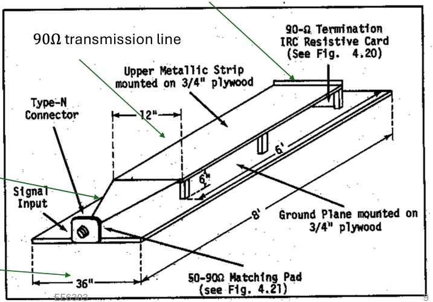
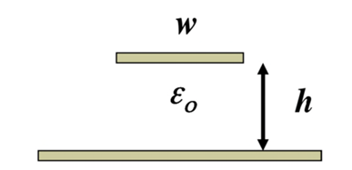
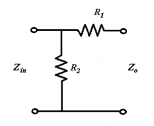
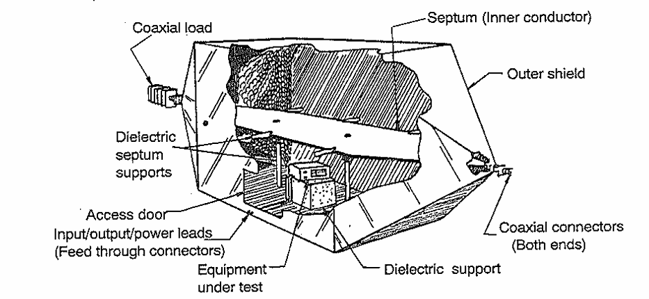
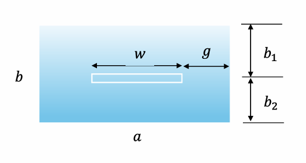
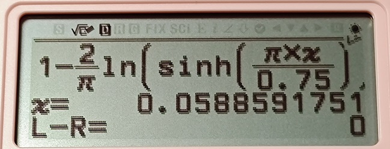
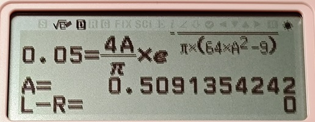
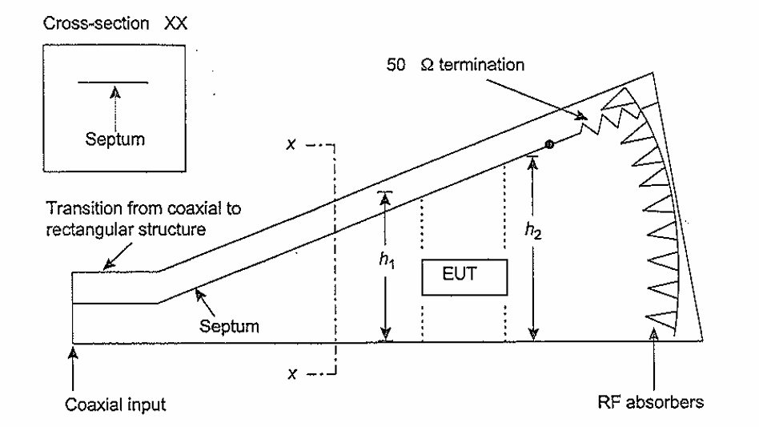
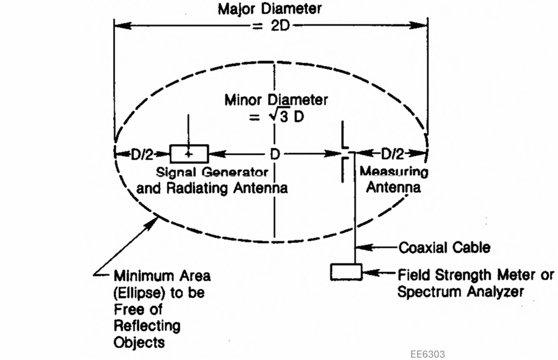

# 平行板传输线/TEM小室/GTEM小室

## 平行板传输线

 

平行板传输线

 

平行板传输线中电磁波传播的模式是TEM波，与远场中电磁波的传输模式相同。

通常Stripline地层最大是信号层的3倍宽，在末端会用与特性阻抗相同大小的电阻连接以消除反射（传输线阻抗匹配）。

在锥形部分，信号层的宽度和高度始终维持 $\frac{w}{h}=2$ 的关系。

### 平行板传输线相关公式

#### 传输线单位长度的电容和电感：

$$C_l=\frac{\epsilon_r \epsilon_0 w}{h}\left(F/m\right)$$

$$L_l=\frac{\mu_r \mu_0 h}{w}\left(H/m\right)$$

（空气近似于自由空间， $\epsilon \approx 1$ ）

#### 相速度

$$v_p=\frac{1}{\sqrt{C_l L_l}}=\frac{1}{\sqrt{\epsilon_r \epsilon_0 \mu_r \mu_0}}$$

#### 特征阻抗

对于平行板传输线：

 

平行板传输线

 

  

$$\eta=\sqrt{\frac{\mu_r \mu_0}{\epsilon_r \epsilon_0}}$$

自由空间下的特征阻抗（空气或者真空）：

$$Z_0=\eta_0\frac{h}{w}\left(\Omega\right)$$

对于带状线（我怎么觉得这玩意应该叫microstrip微带线呢）：

 

带状线

 

  

$$Z_0 \approx \frac{\eta_0}{\frac{w}{h}+2}$$

如果其中的电介质是不色散的，那么传输线的特征阻抗和频率无关。

#### 插入损耗

插入损耗可以用匹配网络前后的电压值计算。

$$\mathrm{Insertion\ Loss}=20log\frac{V_1}{V_2}$$

如果使用电阻分压网络，只需要计算前后电阻的分压值即可获得插入损耗。（其实就是前后功率的损耗）

#### 电阻匹配网络的电阻计算

 

电阻匹配网络

 

针对这种类型的电阻匹配网络，只需要保证

$$
\begin{cases}
    Z_{in}=R_2 || \left(R_1+Z_0\right) \\
    Z_0=R1+Z_{in} || R_2
\end{cases}
$$

解这个二元方程组就能够得到 $R_1$ 、 $R_2$ 的值。

如果引入一个辅助值

$$Z^{'}=1-\frac{Z_{in}}{Z_0}$$

那么可以计算得到

$$
\begin{cases}
    R_1=Z_0\sqrt{Z_{'}} \\
    R_2=\frac{Z_{in}}{\sqrt{Z_{'}}}
\end{cases}
$$

### 平行板传输线的优势与劣势

#### 优势

架设容易

成本低

没有频率限制

#### 劣势

自身的电场容易被周围的物体或者电磁传输干扰

如果产生高电场可能会对周围的设备产生干扰

### Example 1

这个传输线底层宽 $3.75m$

按照那个3倍的经验公式，可以算出来顶层宽 $1.25m$

题干中 $h=0.5m$ ，可以计算得到

$$Z_0 \approx \frac{\eta_0}{\frac{w}{h}+2} = \frac{120\pi}{\frac{1.25}{0.5}+2}=83.776 \mathrm{\Omega}$$

### Example 2

设计匹配网络用前面提到的公式：

$$
\begin{cases}
    R_1=Z_0\sqrt{Z_{'}} \\
    R_2=\frac{Z_{in}}{\sqrt{Z_{'}}} \\
    Z^{'}=1-\frac{Z_{in}}{Z_0}
\end{cases}
$$

直接带进去得到：$Z^{'}=0.40317$ 、 $R_1=53.19\mathrm{\Omega}$ 、 $R_2=78.746$

（从这里可以看出老印的计算精度确实让人比较恼火，难怪open ending）

### Example 3

欧姆定律 $P=\frac{U^2}{R}$ 直接出 $V_{in}=35.36\mathrm{V}$. 这边功放输出是 $25\mathrm{W}$ 而不是 $50\mathrm{W}$ ，不能搞错。

然后用分压就能算出来后续的电压为 $V_s=21.6V$

（需要注意的是从功率算出来的电压值为交流电的均方根值，并不是正弦波的峰值）

然后就是场强计算 $E=\frac{V_s}{h}=43.2 \mathrm{V/m}$

## TEM CELL（TEM小室）

这玩意长得像个放大版的同轴线，然后把待测物体放到这个同轴线里面。内部是个平行板，外部被屏蔽壳包裹，平行板与外壳用介电系数尽可能接近于1的电介质隔开。电磁波传播模式也是TEM模。

 

TEM CELL

 

### TEM CELL相关公式

 

TEM CELL的横截面

 

#### 特征阻抗

$$Z_0 \approx \frac{30\pi}{\frac{a}{b}-\frac{2}{\pi}ln\left[sinh\left(\frac{\pi g}{b}\right)\right]}$$

其中 $sinh\left(x\right)=\frac{1}{2}(e^x-e^{-x})$

（推过了，这个式子是对的）

#### 最大工作频率

当TEM CELL中电磁波的模式变为 $TE_{10}$ 模时，此时的频率是其最高工作频率。它在设计上是用来传输 $TEM$ 模的，如果变成 $TE_{10}$ 模就不符合设计要求了，所以是最高工作频率。

$$f_c=\frac{150}{a}\sqrt{1+\frac{ab}{\pi b_1 b_2 ln\left(\frac{4a}{\pi g}\right) }}$$

如果用当中隔板的相对位置表示，可以代入

$$
\begin{cases}
    &b_1=xb \\
    &b_2=\left(1-x\right)b
\end{cases}
$$

得到

$$f_c=\frac{150}{a}\sqrt{1+\frac{a/b}{\pi x \left(1-x\right) ln\left(\frac{4a}{\pi g}\right)}}$$

### TEM CELL的设计方法

感觉很拍脑袋的做法。

需要满足的基础条件：

$$b_2 \geq \frac{3H}{2}$$

$$w > W$$

根据这个确定 $b$ 的取值后查表获得 $a/b$ 和 $w/b$ 的取值。

（我有点想根据 $Z_0 \approx \frac{\eta_0}{4\frac{a}{b}-\frac{2}{\pi}ln\left[sinh\left(\frac{\pi g}{b}\right)\right]}$ 暴力求解，只需要确定 $a/b$ 就能暴力反推出 $g$ 和 $w$的值）

然后计算 $f_c$

### TEM CELL的优缺点

#### 优点

内部的测试不会受到周围物体和辐射的干扰

内部的强电场不会干扰周围的电子设备

#### 限制

工作频率 $DC-f_c$

### Example 1
**PPT上的过程实在是太混沌了，我尝试尽量计算出结果而不是查表**

根据 $H=0.25m$ 确定 $b_2=0.375m$ ，所以 $b=0.75m$

根据 $w > W$ 判断出 $a$ 至少要大于 $0.5m$

拍脑袋取 $\frac{a}{b}=1$

根据

$$Z_0 \approx \frac{\eta_0}{4\frac{a}{b}-\frac{2}{\pi}ln\left[sinh\left(\frac{\pi g}{b}\right)\right]}=50\mathrm{\Omega}$$

 

使用SOLVER求解

 

解得 $g=0.058m$ , 得到 $w=0.634m$ 大于 $W=0.5m$ 所以这个方案可行。

计算 $f_c$ ：

$$f_c=\frac{150}{a}\sqrt{1+\frac{a/b}{\pi x \left(1-x\right) ln\left(\frac{4a}{\pi g}\right)}}=241.67\mathrm{MHz}$$

### Example 2
**PPT上的过程实在是太混沌了，我尝试尽量计算出结果而不是查表第二弹**

根据DUT高度 $0.1m$ 确定 $b=0.3m$

根据 $f_c$ 公式

$$f_c=\frac{150}{a}\sqrt{1+\frac{a/b}{\pi x \left(1-x\right) ln\left(\frac{4a}{\pi g}\right)}}=400MHz$$

解得

$$g=\frac{4a}{\pi}e^{-\frac{30a}{0.25\pi \left(64a^2-9\right)}}$$

 

使用SOLVER求解

 

取 $g=0.05m$ 解得 $a=0.5m$ 、 $w=0.4m$

## GTEM CELL

这玩意是G赫兹TEM小室的简称，图长这样。隔板末端也是有50欧的负载，并且还需要贴有吸波材料防止反射。能够支持 $1\mathrm{GHz}$ 以上的频率。

 

GTEM CELL

 

### GTEM CELL的优缺点

#### 优点

工作频率可以从 $DC$ 到数 $GHz$

有屏蔽

#### 缺点

对于大东西测试来说小了点

贵

# OATS (Open Area Test Site)

 

OATS

 

## 测试的注意事项

周围不会有引发反射的物体（一般在郊区）

需要一个导电的地平面

一般用3m法和10m法进行测试

## 优缺点

## 优点

建造和维护容易

成本非常低

## 缺点

会受到天气影响

环境电磁环境会影响发射的测量

高功率辐射测量可能会影响到周围的环境

由于环境噪声不同，测试结果不可复现

# Shielded Enclosure

#
