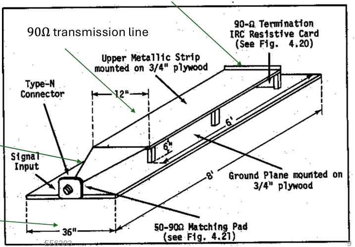
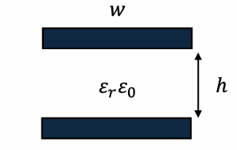
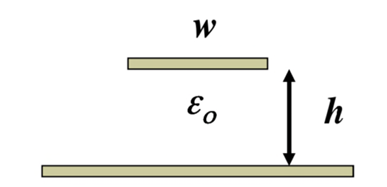
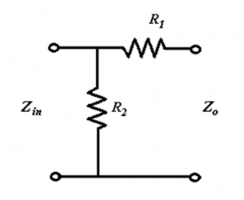
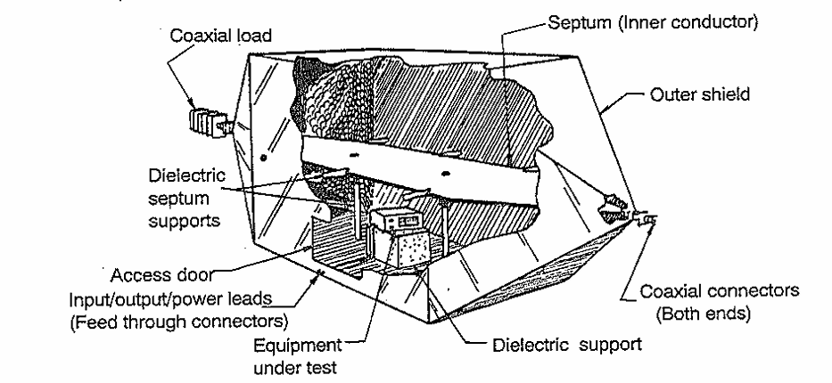
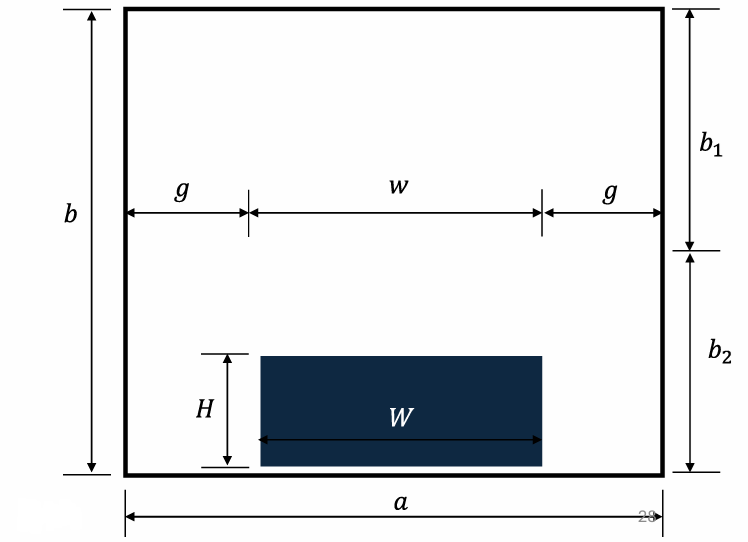
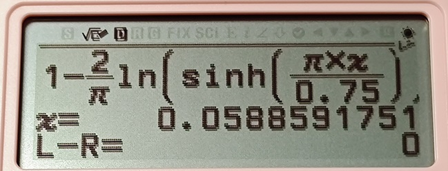
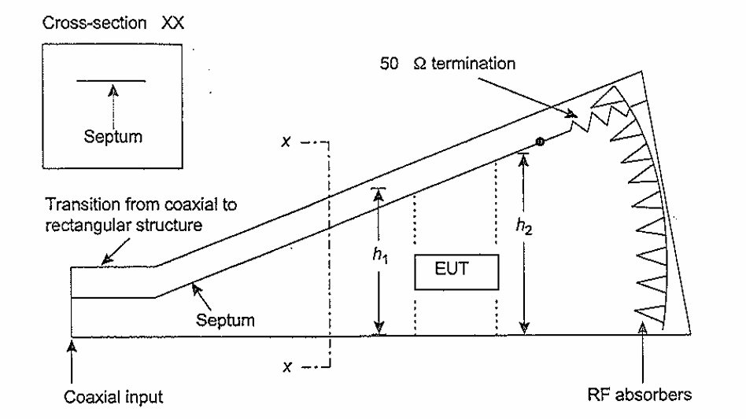
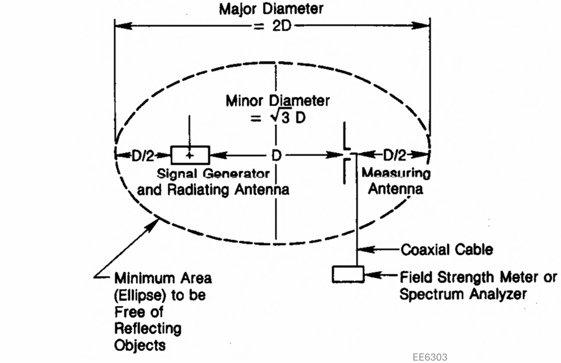
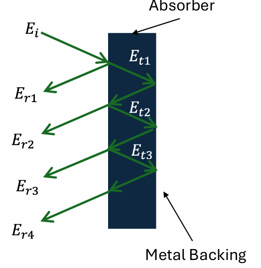

# 平行板传输线/TEM小室/GTEM小室

## 平行板传输线

 

平行板传输线

 

平行板传输线中电磁波传播的模式是TEM波，与远场中电磁波的传输模式相同。

通常Stripline地层最小是信号层的3倍宽，在末端会用与特性阻抗相同大小的电阻连接以消除反射（传输线阻抗匹配）。

在锥形部分，信号层的宽度和高度始终维持 $\frac{w}{h}=2$ 的关系。

### 平行板传输线相关公式

#### 传输线单位长度的电容和电感：

$$C_l=\frac{\epsilon_r \epsilon_0 w}{h}\left(F/m\right)$$

$$L_l=\frac{\mu_r \mu_0 h}{w}\left(H/m\right)$$

（空气近似于自由空间， $\epsilon \approx 1$ ）

#### 相速度

$$v_p=\frac{1}{\sqrt{C_l L_l}}=\frac{1}{\sqrt{\epsilon_r \epsilon_0 \mu_r \mu_0}}$$

#### 特征阻抗

对于平行板传输线：

 

平行板传输线

 

  

$$\eta=\sqrt{\frac{\mu_r \mu_0}{\epsilon_r \epsilon_0}}$$

自由空间下的特征阻抗（空气或者真空）：

$$Z_0=\eta_0\frac{h}{w}\left(\Omega\right)$$

对于带状线（我怎么觉得这玩意应该叫microstrip微带线呢）：

 

带状线

 

  

$$Z_0 \approx \frac{\eta_0}{\frac{w}{h}+2}$$

如果其中的电介质是不色散的，那么传输线的特征阻抗和频率无关。

#### 插入损耗

插入损耗可以用匹配网络前后的电压值计算。

$$\mathrm{Insertion\ Loss}=20log\frac{V_1}{V_2}$$

如果使用电阻分压网络，只需要计算前后电阻的分压值即可获得插入损耗。（其实就是前后功率的损耗）

#### 电阻匹配网络的电阻计算

 

电阻匹配网络

 

针对这种类型的电阻匹配网络，只需要保证

$$
\begin{cases}
    Z_{in}=R_2 || \left(R_1+Z_0\right) \\
    Z_0=R1+Z_{in} || R_2
\end{cases}
$$

解这个二元方程组就能够得到 $R_1$ 、 $R_2$ 的值。

如果引入一个辅助值

$$Z^{\prime}=1-\frac{Z_{in}}{Z_0}$$

那么可以计算得到

$$
\begin{cases}
    R_1=Z_0\sqrt{Z_{\prime}} \\
    R_2=\frac{Z_{in}}{\sqrt{Z_{\prime}}}
\end{cases}
$$

### 平行板传输线的优势与劣势

#### 优势

架设容易

成本低

没有频率限制

#### 劣势

自身的电场容易被周围的物体或者电磁传输干扰

如果产生高电场可能会对周围的设备产生干扰

### Example 1

这个传输线底层宽 $3.75m$

按照那个3倍的经验公式，可以算出来顶层宽 $1.25m$

题干中 $h=0.5m$ ，可以计算得到

$$Z_0 \approx \frac{\eta_0}{\frac{w}{h}+2} = \frac{120\pi}{\frac{1.25}{0.5}+2}=83.776 \mathrm{\Omega}$$

### Example 2

设计匹配网络用前面提到的公式：

$$
\begin{cases}
    R_1=Z_0\sqrt{Z_{\prime}} \\
    R_2=\frac{Z_{in}}{\sqrt{Z_{\prime}}} \\
    Z^{\prime}=1-\frac{Z_{in}}{Z_0}
\end{cases}
$$

直接带进去得到： $Z^{\prime}=0.40317$ 、 $R_1=53.19\mathrm{\Omega}$ 、 $R_2=78.746$

（从这里可以看出老印的计算精度确实让人比较恼火，难怪open ending）

### Example 3

欧姆定律 $P=\frac{U^2}{R}$ 直接出 $V_{in}=35.36\mathrm{V}$. 这边功放输出是 $25\mathrm{W}$ 而不是 $50\mathrm{W}$ ，不能搞错。

然后用分压就能算出来后续的电压为 $V_s=21.6V$

（需要注意的是从功率算出来的电压值为交流电的均方根值，并不是正弦波的峰值）

然后就是场强计算 $E=\frac{V_s}{h}=43.2 \mathrm{V/m}$

## TEM CELL（TEM小室）

这玩意长得像个放大版的同轴线，然后把待测物体放到这个同轴线里面。内部是个平行板，外部被屏蔽壳包裹，平行板与外壳用介电系数尽可能接近于1的电介质隔开。电磁波传播模式也是TEM模。

 

TEM CELL

 

### TEM CELL相关公式

 

TEM CELL的横截面

 

#### 特征阻抗

$$Z_0 \approx \frac{30\pi}{\frac{a}{b}-\frac{2}{\pi}ln\left[sinh\left(\frac{\pi g}{b}\right)\right]}$$

其中 $sinh\left(x\right)=\frac{1}{2}(e^x-e^{-x})$

（推过了，这个式子是对的）

#### 最大工作频率

当TEM CELL中电磁波的模式变为 $TE_{10}$ 模时，此时的频率是其最高工作频率。它在设计上是用来传输 $TEM$ 模的，如果变成 $TE_{10}$ 模就不符合设计要求了，所以是最高工作频率。

$$f_c=\frac{150}{a}\sqrt{ 1+\frac{ab}{\pi b_1 b_2 ln\left(\frac{4a}{\pi g}\right) }}$$

如果用当中隔板的相对位置表示，可以代入

$$
\begin{cases}
    &b_1=xb \\
    &b_2=\left(1-x\right)b
\end{cases}
$$

得到

$$f_c=\frac{150}{a}\sqrt{ 1+\frac{a/b}{\pi x \left(1-x\right) ln\left(\frac{4a}{\pi g}\right)}}\left(\mathrm{MHz}\right)$$

### TEM CELL的设计方法

感觉很拍脑袋的做法。

需要满足的基础条件：

$$b_2 \geq \frac{3H}{2}$$

$$w > W$$

根据这个确定 $b$ 的取值后查表获得 $a/b$ 和 $w/b$ 的取值。

（我有点想根据 $Z_0 \approx \frac{\eta_0}{4\left(\frac{a}{b}-\frac{2}{\pi}ln\left[sinh\left(\frac{\pi g}{b}\right)\right]\right)}$ 暴力求解，只需要确定 $a/b$ 就能暴力反推出 $g$ 和 $w$的值）

然后计算 $f_c$

### TEM CELL的优缺点

#### 优点

内部的测试不会受到周围物体和辐射的干扰

内部的强电场不会干扰周围的电子设备

#### 限制

工作频率 $DC-f_c$

### Example 1
**PPT上的过程实在是太混沌了，我尝试尽量计算出结果而不是查表**

根据 $H=0.25m$ 确定 $b_2=0.375m$ ，所以 $b=0.75m$

根据 $w > W$ 判断出 $a$ 至少要大于 $0.5m$

拍脑袋取 $\frac{a}{b}=1$

根据

$$Z_0 \approx \frac{\eta_0}{4\left(\frac{a}{b}-\frac{2}{\pi}ln\left[sinh\left(\frac{\pi g}{b}\right)\right]\right)}=50\mathrm{\Omega}$$

解得 $g=0.058m$ , 得到 $w=0.634m$ 大于 $W=0.5m$ 所以这个方案可行。

 

使用SOLVER求解

 

计算 $f_c$ ：

$$f_c=\frac{150}{a}\sqrt{1+\frac{a/b}{\pi x \left(1-x\right) ln\left(\frac{4a}{\pi g}\right)}}=241.67\mathrm{MHz}$$

### Example 2
**数值计算，991能做，别怕**

根据DUT高度 $0.1m$ 确定 $b=0.3m$

根据 $f_c$ 公式，把截止频率提高点免得翻车。

$$f_c=\frac{150}{a}\sqrt{1+\frac{a/b}{\pi x \left(1-x\right) ln\left(\frac{4a}{\pi g}\right)}}=450MHz$$

解得

$$g=\frac{4a}{\pi}e^{-\frac{6a}{5\pi \left(9a^2-1\right)}}$$

将 $g$ 带回特征阻抗方程，解得

$$a=0.34127m$$

从而获得 

$$g=0.029069m$$

## GTEM CELL

这玩意是G赫兹TEM小室的简称，图长这样。隔板末端也是有50欧的负载，并且还需要贴有吸波材料防止反射。能够支持 $1\mathrm{GHz}$ 以上的频率。

 

GTEM CELL

 

### GTEM CELL的优缺点

#### 优点

工作频率可以从 $DC$ 到数 $GHz$

有屏蔽

#### 缺点

对于大东西测试来说小了点

贵

# OATS (Open Area Test Site)

 

OATS

 

## 测试的注意事项

周围不会有引发反射的物体（一般在郊区）

需要一个导电的地平面

一般用3m法和10m法进行测试

## 优缺点

## 优点

建造和维护容易

成本非常低

## 缺点

会受到天气影响

环境电磁环境会影响发射的测量

高功率辐射测量可能会影响到周围的环境

由于环境噪声不同，测试结果不可复现

# Shielded Enclosure

## 相关公式

### Shielding Effectiveness

这玩意指的是入射波的强度和透射波的关系。这个值越高表示透射波衰减越厉害。

$$SE\left(\mathrm{dB}\right)=R\left(\mathrm{dB}\right)+A\left(\mathrm{dB}\right)+B\left(\mathrm{dB}\right)$$

其中 $SE$ 指的是Shielding Effectiveness、 $R$ 是入射波与吸波材料的反射损耗、 $A$ 是吸波材料的吸收、 $B$ 表示吸波材料与透射波交界面处的反射损耗。都是越大越好。

#### 吸收系数A

复传播系数

$$\gamma=\alpha + j \beta=\sqrt{j\omega\mu\left(\sigma+j\omega\epsilon\right)}$$

在复传播系数中，实部表示损耗，虚部表示相移。在这里我们主要考虑 $\alpha$ ，它表示波传播单位长度后振幅衰减 $e^{-\alpha}$ .

所以我们可以得到 

$$A\left(\mathrm{dB}\right)=20log_{10}\left(e^{-ar}\right)$$

为了从振幅转换成功率， $log$ 前面的数字为20

对于理想导体和良导体有 $\sigma \gg \omega\epsilon$ ，可以取近似为 $\alpha \approx \sqrt{\frac{\omega\mu\sigma}{2}}$ ，可以推出良导体中的吸收系数为：

$$A\left(\mathrm{dB}\right)=20log_{10}\left(e^{-ar}\right)=-20log_{10}e\times r\sqrt{\frac{\omega\mu\sigma}{2}}$$

一些其他的变形：

用相对电导率替换电导率、频率替换角频率、材料厚度 $t$ 替换传播距离 $r$ ：

$$A\left(\mathrm{dB}\right)=-20log_{10}e\times t\sqrt{\pi f \mu \sigma_c \sigma_r}$$

用趋肤深度 $\delta=\sqrt{\frac{1}{\pi f \mu \sigma}}$ 替换：

$$A\left(\mathrm{dB}\right)=-20log_{10}e\times \frac{t}{\delta}$$

用相对磁导率和电导率替换（此处 $t$ 的单位是 $\mathrm{cm}$ ）：

$$A\left(\mathrm{dB}\right)=1.314 t \sqrt{f \mu_r \sigma_r}$$

（你是孔乙己吗整这么多没啥卵用的变形，草）

#### 反射损耗

（总觉得这里有点问题，老印多了个平方）

在垂直入射的情况下（非垂直入射的情况我推了一晚上推爆炸了，还不知道对不对，不写了），不同介质之间的关系可以用传输线进行建模，可得透射系数相对于阻抗的关系为：

$$T=\frac{2\sqrt{\eta_1\eta_2}}{\eta_1 + \eta_2}$$

其中 $\eta_1$ 为入射波的特征阻抗， $\eta_2$ 为透射波的特征阻抗。

其中透射波的阻抗可以用下式计算

$$\eta_2 = \sqrt{\frac{j\omega\mu}{\left(\sigma+j\omega\epsilon\right)}}$$

假设入射波功率为 $P_0$ ，则透射波功率为 $P_0\times T^2$

可以知道反射损耗为 

$$\mathrm{Reflection\ Loss}=10log_{10}\left(P_0-P_0\times T^2\right)=-10log_{10}T^2=-10log_{10}\left(\frac{4\eta_1\eta_2}{\left(\eta_1 + \eta_2\right)^2}\right)$$

老印的式子是： $\mathrm{Reflection\ Loss}=-20log_{10}\left(\frac{4\eta_1\eta_2}{\left(\eta_1 + \eta_2\right)^2}\right)$ 他写的有问题，正确的系数都是10。

对于金属屏蔽罩， $\omega \epsilon \ll \sigma$ 

可以得到

$$\left|\eta_2\right| = \left|\sqrt{\frac{j\omega\mu}{\left(\sigma+j\omega\epsilon\right)}}\right| \approx \sqrt{\frac{\omega\mu}{\sigma}}$$

又由于 $\eta_1 \gg \eta_2$ 从而对反射损耗进行近似：

$$R \approx -20(10?)log_{10}\left|\frac{4\eta_2}{\eta_1}\right|$$

##### 材料对平面波的反射损耗：

入射波的特征阻抗为 $120\pi$ 所以可以得到

$$R = -20(10?)log_{10}\left(\frac{4\sqrt{\frac{2\pi f \mu_0 \mu_r}{\sigma_c \sigma_r}}}{120\pi}\right)$$

其中 $\mu_0$ 为真空磁导率， $\sigma_c$ 为铜的电导率。两个下标是 $r$ 的是相对值。

##### 材料对电场的反射损耗：

入射电场的特征阻抗 

$$\eta_1=\frac{\eta_0}{\beta_0 r}$$

代入真空光速 

$$c_0=\frac{1}{\sqrt{\mu_0 \epsilon_0}}$$

代入相位系数

$$\beta_0=\frac{2\pi}{\lambda}=\frac{\omega}{c_0}$$

可以得到

$$\eta_1=\frac{1}{\omega \epsilon_0 r}=\frac{1}{2\pi f \epsilon_0 r}$$

$$R \approx -20(10?)log_{10}\left(8\pi f\epsilon_0 r\sqrt{\frac{2\pi f \mu}{\sigma}}\right)$$

##### 材料对磁场的反射损耗

类似地，可以计算出入射磁场的特征阻抗：

$$\eta_1=\eta_0\beta_0 r=2\pi f\mu_0 r$$

代入可以得到反射损耗约为：

$$R \approx -20(10?)log_{10}\left(\frac{4\sqrt{\frac{2\pi f \mu}{\sigma}}}{2\pi f \mu_0 r}\right)$$

## 电波暗室的土木工程

**略**

## 电波暗室的吸波材料

反射率是描述反射电场强度的指标

吸波材料的反射率是入射角、反射角的函数（我前面在计算反射损耗的时候着重强调了**垂直入射**，就是因为这个）

 

吸波材料的反射特性

 

$$
\begin{cases}
    E_{ra}&=E_{r1}+E_{r2}+E_{r3}+... \\
    E_{r1}&=E_i-E_{t1} \\
    E_{r2}&=E_{t1}\times A-E_{t2} 
\end{cases}
$$

（这边老印想表达的是功率的关系吧，如果 $E$ 表示的是电场的话还需要分别计算垂直和平行分量然后计算）

### 测量吸波材料的反射率

1、测量入射波到理想导电平面（PEC）的反射

2、计算反射电场强度和入射电场强度的比

$$\frac{E_{r_{PEC}}}{E_i}$$

3、把吸波材料放到PEC上，测量反射场强并计算

$$\frac{E_{r_{Absorb}}}{E_i}$$

4、反射率计算（你看这个公式就是功率的公式，说明确实是需要从功率方面考虑的，而不是前面的场强加减）

$$R=20log_{10}\left(\frac{E_{r_{Absorb}}}{E_i}\frac{E_i}{E_{r_{PEC}}}\right)$$

5、重复不同的入射角计算

### 吸波材料的种类

#### Dielectric Absorber

轻

高介电损失（考虑复介电系数 $\epsilon=\epsilon^{\prime}+j\epsilon^{\prime\prime}$ 对于复介电系数，实部的定义与一般的介电系数相同，虚部表示电流在介质中的损耗）

无磁性 $\mu_r=1$

超宽带

厚

##### 相关公式

波在高介电损失材料中的传播：

使用复传播系数解亥姆霍兹方程：

$$E\left(t\right)=E_0\left(t\right)e^{-\gamma z}$$

（我理解了很久，总算明白了PPT上这个公式里的t不是时间，而是厚度thickness……这里直接用正常的亥姆霍兹方程解了）

根据复传播系数定义 单位长度的衰减为 $e^{-\alpha}$

根据高介电损失材料的特性 $\mu=\mu_0$ 、 $\sigma=0$

可以得到：

$$\alpha \approx \frac{\omega}{2}\sqrt{\mu_0 \epsilon^{\prime}}\frac{\epsilon^{\prime\prime}}{\epsilon^{\prime}}$$

定义介电损耗角正切为： 

$$D=\frac{\epsilon^{\prime\prime}}{\epsilon^{\prime}}$$

##### Example

（我超这也有啊）

题干条件：

相对介电系数： $\epsilon_r=2.55$

工作频率： $3\mathrm{GHz}$

损耗角正切： $D=\frac{\epsilon^{\prime\prime}}{\epsilon^{\prime}}=0.00033$

计算复传播系数的实部：

$$
\alpha\approx \frac{\omega}{2}\sqrt{\mu_0 \epsilon^{\prime}}\frac{\epsilon^{\prime\prime}}{\epsilon^{\prime}} \\
=\pi f \sqrt{\mu_0 \epsilon_0 \epsilon_r}\frac{\epsilon^{\prime\prime}}{\epsilon^{\prime}}\\
=0.01657
$$

如果厚度为 $10\mathrm{cm}$

$$A=20log_{10}e^{-\alpha z}=-0.0144\mathrm{dB}$$

真空磁导率： $\mu_0=4\pi\times 10^{-7}$

真空介电常数： $\epsilon_0=8.854 \times 10^{-12}$

##### 电波暗室使用的Dielectric Absorber的一些特性

被造成金字塔型

金字塔的高度决定了对不同频率的吸收率

反射率在30-50dB之间

工作频率：数百MHz到数GHz

#### Magnetic Absorber

使用含有磁性的材料（铁氧体、碳、镍）

薄

重

有损耗（不太理解，没损耗还能叫吸波材料么）

窄带

在低频下工作良好

##### 相关公式

仍然使用亥姆霍兹方程的解（真好用）：

$$E\left(t\right)=E_0\left(t\right)e^{-\gamma z}$$

与复介电系数类似，复磁导率的虚部表示介质的损耗。

对于复磁导率

$$\mu=\mu^\prime-j\mu^{\prime\prime}$$

可以计算得到复传播系数的实部:

$$\alpha \approx \frac{\omega}{2}\sqrt{\epsilon_0 \mu^\prime}\frac{\mu^{\prime\prime}}{\mu^\prime}$$

同样地这里也存在磁场的损耗角正切

##### 电波暗室使用的Magnetic Absorber一些特性

薄铁氧体陶瓷瓦片

频率范围30MHz-1GHz

能承受高温和高功率

非常重（每平方米数十kg）

## 电波暗室的优缺点

### 优点

测试物的体积没有限制

可以测量数十Hz到40GHz甚至更高

支持电场、磁场和平面波测量

屏蔽效率大于100dB，能支持高功率辐射测量，低辐射泄漏

### 缺点

为了覆盖频率、照射角和极化方向需要的时间很长

如果要测量更大的物体和更长的测试距离，需要更大的暗室

非常贵

# Mode stirred chambers/reverberation chamber（模式搅拌室/电波混响室）

## 基本信息

腔室墙壁和搅拌器由高导电材料制成

搅拌器的旋转会改变腔体的边界条件

在不同的搅拌器位置，会出现不同的共振模式

腔室内生成的电磁场有如下特性：

振幅均匀

各个方向上各向同性

随机极化

## 测试的特点

### 抗干扰测试

测试对象将从所有方向和所有极化方式被均匀照射

不需要旋转测试对象

与在电波暗室中进行远场测试相比，产生共振所需的功率要少得多

没有方向性信息

## 发射测试

从所有方向接收测试对象的发射

不需要旋转测试对象

产生的共振使发射测试更加敏感

没有方向性信息

## 最低可用频率LUF

LUF是最低谐振频率的大约4倍

最低谐振频率的定义：

$$f_{mnp}=\frac{c}{2}\sqrt{\left(\frac{m}{a}\right)^2+\left(\frac{n}{b}\right)^2+\left(\frac{p}{h}\right)^2}$$

其中 $c$ 为真空光速， $a$ 、 $b$ 、 $h$ 是这个房间的长宽高.

 $m$ 、 $n$ 、 $p$ 是正整数，表示电磁波在房间中的模式分布，最多有一个可以是 $0$

## 品质因数Q值

定义：

$$Q=\omega\frac{最大储存的能量}{平均能量损失}$$

$$\frac{1}{Q_{total}}=\frac{1}{Q_1}+\frac{1}{Q_2}$$

其中 $Q_1$ 是墙壁导致的损失， $Q_2$ 是天线的损失

$$Q_1=\frac{3V}{2\mu_r S \delta (\omega)}$$

其中 $V$ 是内部体积， $S$ 是内部墙壁表面积， $\delta(\omega)$ 是电磁波在导体的趋肤深度

$$Q_2=\frac{16 \pi^2 V}{m N \lambda^3}$$

其中 $m$ 是天线阻抗失配导致的损失， $N$ 是总天线数量

对于测量到的 $Q$ 值，定义如下：

$$Q=\frac{16\pi^2 V \left\langle P_R\right\rangle}{\lambda^3 \left\langle P_T\right\rangle}$$

$\left\langle P_R\right\rangle$ 和 $\left\langle P_T\right\rangle$ 分别是接收和发射功率的系统平均值

## 房间增益

定义为：

$$ \left\langle G\right\rangle=\frac{\left\langle P_R\right\rangle}{\left\langle P_T\right\rangle}$$

## 测量到的电场

定义为：

$$\left\langle|E_T|^2\right\rangle=\frac{8\pi}{\epsilon_0 c \lambda^2}\left\langle P_R\right\rangle=\left\langle|E_x|^2\right\rangle+\left\langle|E_y|^2\right\rangle+\left\langle|E_z|^2\right\rangle$$

## Example

根据题意可以得到：

$$a=1.136m$$

$$b=0.77m$$

$$h=0.535m$$

在 $f_{011}$ 、 $f_{101}$ 、 $f_{110}$ 中找到最低的频率为  $f_{110}$

$$f_{110}=\frac{c}{2}\sqrt{\left(\frac{m}{a}\right)^2+\left(\frac{n}{b}\right)^2+\left(\frac{p}{h}\right)^2}=235.339\mathrm{MHz}$$

$$LUF=4f_{110}=941.351\mathrm{MHz}$$
