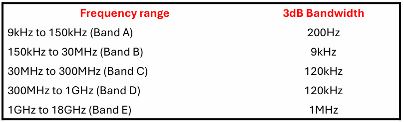
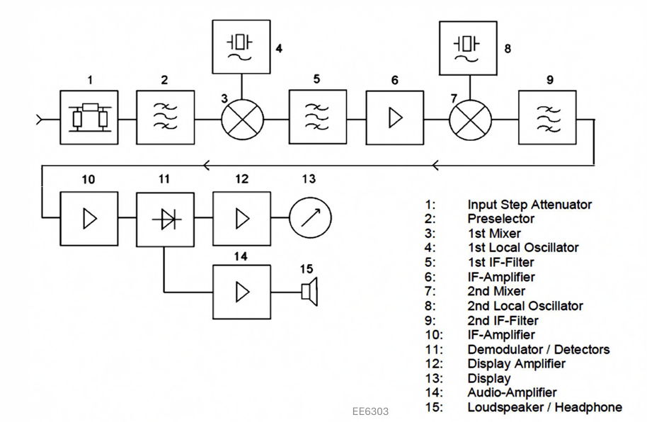
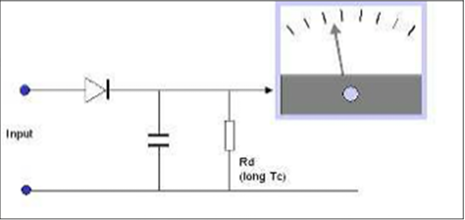
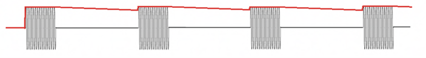
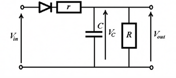
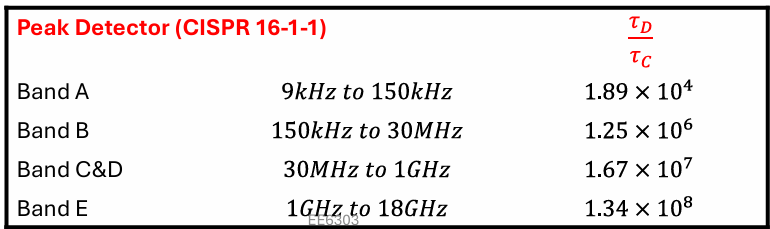
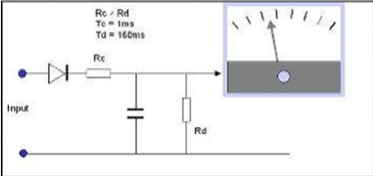
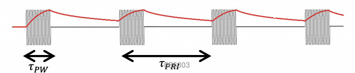
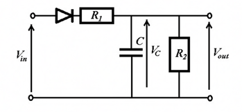
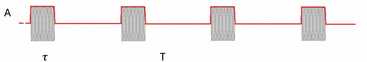

# EMI接收机

EMI接收机用于测量EUT的辐射

检波器：QP、PK、RMS、AV

 

CISPR 16-1-1提供了关于EMI接收机的数据

 

     

EMI接收机的框图

 

根据EMI接收机的框图可以看出，这是一台二次变频类型的接收机

## 窄带信号

3dB带宽小于接收机3dB带宽的信号（要求信号的载波与接收机的接收频率相同）

一般是CW连续波、调制后且带宽小于接收机带宽的CW连续波信号

## 宽带信号

带宽大于接收机3dB带宽的信号

窄脉冲（冲激函数）、时钟信号（谐波分量大，频谱图为sinc函数的包络）、UWB脉冲（超宽带脉冲）

（这后面的图我没看懂，也不知道他在讲什么。好像也不是卷积效应）

# 检波器

接收机的检波器一般用来测量目标信号的功率或者电压

对于没有调制的信号（CW连续波），所有检波器必须输出相同的RMS值。RMS值得定义如下，其与峰值得关系是：

$$V_{RMS}=\sqrt{\frac{1}{T}\int_{0}^T A^2 cos^2\left(\omega t\right)\mathrm{d}t}=\frac{A}{\sqrt{2}}$$

**类型**

Peak Detector(PK)

Quasi Peak Detector(QP)

Root Mean Square Detector(RMS)

Average Detector(AV)

## Peak Detector/峰值检波器 

充电的时间常数极小

放电的时间常数非常长

显示的是与脉冲重复无关的峰值

显示出的最大幅度：PK>QP,RMS

 

<B>峰值检波器电路</B>

 

$R_d$ 用来提供极大的放电时间常数

### 充电特性

 

 

<B>输出电压曲线</B>

 

对于理想二极管，它没有内阻，所以电容两端的电压会瞬间充电到 $V_{in}$

对于真实的二极管，它有内阻 $r$ ，充电时会有一段上升时间（忽略二极管压降）

 

 

<B>真实的电路图</B>

 

电容两端的电压（ $0\leq t \leq \tau_{\mathrm{Pulse\ Width}}$ ）：

$$v_C=V^\prime\frac{R}{R+r}\left(1-e^{-\frac{t}{\tau_{C}}}\right)$$

 $V^\prime$ 在第一个脉冲时等于 $V_{in}$ ，在随后的脉冲中等于 $V_{in}-v_D\left(t=\tau_{PRI}-\tau_{PW}\right)$

其中 $\tau_C=\frac{rRC}{R+r} \approx rC$

当 $R \gg r$ 时约等于成立

### 放电特性

在充电结束后，二极管反偏截止，电容C开始放电。放电特性为：

$$
\begin{cases}
    v_D=V^{\prime\prime}e^{-\frac{t}{\tau_D}} \\
    \tau_D=RC \\
    V^{\prime\prime}=v_C\left(t=\tau_{PW}\right) \\
\end{cases}
$$

上述等式对于 $0 \leq t \leq \tau_{PRI}-\tau_{PW}$ 成立

### 总结

一般用充放电的常数之比来对Peak Detector的规格进行规定：

$$\frac{\tau_D}{\tau_C}\approx\frac{RC}{rC}=\frac{R}{r}$$

对于 CISPR 16-1-1标准
 

 

<B>比值</B>

 

## Quasi Peak Detector/准峰值检波器

准峰值检波器一般用于 $1GHz$ 以上的频率

充电速度快和相对长的放电时间常数

读数受到脉冲重复频率的影响

 

 

<B>峰值检波器电路</B>

 

 

 

<B>输出电压的时域特征</B>

 

其中 

$$\mathrm{Pulse\ Repetition\ Frequency}=\frac{1}{\tau_{PRI}}$$

（I大概是Interval的意思？）

输出电压的方程（与峰值检波器类似，只是充电电阻相比非常大）：

 

 

<B>电路图</B>

 

以脉冲开始为原点算充电特性： $0 \leq t \leq \tau_{PW}$

$$
\begin{cases}
    v_C=V^\prime\frac{R_2}{R_1+R_2}\left(1-e^{-\frac{t}{\tau_C}}\right) \\
    \tau_C=\frac{R_1 R_2 C}{R_1+R_2} \\
    V^\prime=v_{in}-v_D\left(t=\tau_{PRI}-\tau_{PW}\right)
\end{cases}
$$

以脉冲结束为原点算放电特性： $0 \leq t \leq \tau_{PRI}-\tau_{PW}$ 

$$
\begin{cases}
    v_D=V^{\prime\prime}e^{-\frac{t}{\tau_D}} \\
    \tau_D=R_2 C \\
    V^{\prime\prime}=v_C\left(\tau_{PW}\right)
\end{cases}
$$

QP检波器的输出受到脉冲宽度和脉冲间隔的影响（PPT上的图还挺详细的，不写了）

## 其它类型的检波器

### Envelope detector/包络检波器

 

<B>包络检波器输出信号的包络</B>

 

极小的充电和放电时间常数，跟随信号的包络。

### RMS Detector/均方根检波器

测量信号包络的均方根值。

适用于会被热效应影响的设备。

输出为：

$$V_{RMS}=\sqrt{\frac{1}{2T_{dwell}}\int_0^{T_{dwell}}v^2_{env}\left(t\right)\mathrm{d}t} \approx \sqrt{\frac{1}{2T}\int_0^\tau v^2_{env}\left(t\right)\mathrm{d}t}$$

如何理解这一个式子：常见的RMS值并不会出现分子中的2，这边绕了两个弯，还需要区分瞬时RMS值和等效直流RMS值（我的理解，感觉很邪乎）。

1、RMS检波器输入的信号上是**信号的包络**，它并不能直接测量到信号的RMS值。

2、而**信号包络**的来源是**包络检波器**，包络检波器输出的是信号的**局部峰值（这个词是我造的，不知道好不好理解）**，为了将这个局部峰值转换为瞬时RMS值，需要乘 $\sqrt{\frac{1}{2}}$ ，这样造就了检波器输出值中分子里的2. 数学表达如下：

$$\frac{V_{env}\left(t\right)}{\sqrt{2}}=V_{rms}\left(t\right)$$

3、随后RMS检波器对**瞬时RMS值**，继续取RMS值，获得**等效的直流RMS值**。这意味着这个直流RMS值产生的热效应与瞬时RMS值产生的热效应相同。

推导涉及到初中物理知识（雾）：

$$\int_0^T\frac{v_{RMS}^2\left(t\right)}{R}\mathrm{d}t=W_{Heat}=\frac{V_{DCRMS}^2}{R}\times T \\
\implies \frac{1}{T}\int_0^T v_{RMS}^2\left(t\right)\mathrm{d}t=V_{DCRMS}^2\\
\implies \sqrt{\frac{1}{T}\int_0^T v_{RMS}^2\left(t\right)\mathrm{d}t}=V_{DCRMS}\\
$$

代入 $\frac{v_{env}\left(t\right)}{\sqrt{2}}=v_{RMS}\left(t\right)$

得到：

$$V_{DCrms}=\sqrt{\frac{1}{2T}\int_0^T v_{env}^2\left(t\right)\mathrm{d}t}$$

对于矩形脉冲串：

$$V_{RMS}\approx \frac{A}{\sqrt{2}}\frac{\tau}{T}$$

### Average Detector/平均值检波器

测量信号包络的平均值。

对于有着长积分时间的设备适用。

输出电压的关系为：

$$V_{Ave}=\frac{1}{\sqrt{2}T_{dwell}}\int_0^{T_{dwell}}v_{env}\left(t\right)\mathrm{d}t$$

$$V_{Ave}\approx \frac{A}{\sqrt{2}}\frac{\tau}{T}$$

但是从这里看，应该是信号瞬时RMS值的平均值，不是很懂老印的绕法。绕来绕去已经糊涂了。

对于上述两个检波器，有：

$$V_{rms} \geq V_{Ave}$$

## 接收机到底测试的是什么？（先只考虑PK和QP吧，其他的检波器已经内置积分了）

接收机会对检波器输出的信号进行积分，积分时长为 $T_{dwell}$ 输出为：

$$V_{Det}=\frac{1}{\sqrt{2}T_{dwell}}\int_0^{T_{dwell}}v_D\left(t\right)\mathrm{d}t$$

由于峰值或者准峰值检波输出的是信号的峰值或准峰值，所以如果要获得信号的RMS值，需要除 $\sqrt{2}$ .

为了达到稳定的输出，需要 $T_{dwell} > PRI$ ，所以积分时长包含数个充放电过程。

$$V_{Det}=\frac{1}{\sqrt{2}T_{dwell}}\left(\int_0^{\tau_{PW}}v_{C1}\mathrm{d}t+\int_0^{\tau_{PRI}-\tau_{PW}}v_{D1}\mathrm{d}t+\int_0^{\tau_{PW}}v_{C2}\mathrm{d}t+\int_0^{\tau_{PRI}-\tau_{PW}}v_{D2}\mathrm{d}t+\cdots\right)$$

对于PK，得到的将是脉冲的RMS电压值。

## Detector Example 1

这么这么这么长一串，只是为了告诉你，PK的输出约等于信号的峰值

根据CISPR标准计算 $\tau_C$ 和 $\tau_D$

$$\tau_C\approx rC,\tau_D\approx RC, \frac{\tau_D}{\tau_C}=1.67\times10^7$$

$$\tau_D\approx 17.8s,\tau_C\approx 1.07\mu s$$

首先考虑PK的输出电压特性：

$$v_C\left(t\right)=V^\prime\left(1-e^{-\frac{t}{\tau_C}}\right)=\left(V_{in}-V_{D_{end}}\right)\left(1-e^{-\frac{t}{\tau_C}}\right)$$

在第一个脉冲来临时 $V^\prime\approx V_{in}$ ，代入 $\tau_C$ 和 $t=\tau_{PW}$ 可得充电结束电压 $V^{\prime\prime}$为：

$$V^{\prime\prime}=V_{in}\left(1-e^{-\frac{50\mu s}{1.07\mu s}}\right)\approx V_{in}$$

继续计算放电结束电压 $V_{D_{end}}$ 代入 $t=\tau_{PRI}-\tau_{PW}$：

$$V_{D_{end}}=V^{\prime\prime}e^{-\frac{t}{\tau_D}}\approx V_{in}e^{-\frac{2450\mu s}{17.5s}}\approx V_{in}$$

归纳可以得到：

$$v_{C2}=v_{C3}=v_{Cn}=V_{in}$$

$$v_{D2}=v_{D3}=v_{Dn}=V_{in}$$

所以可以得到，对于Peak Detector，其输出电压为：

$$v_D=V_{in}$$
 

继续这么长一串，告诉你接收机接收到的电压是 $\frac{V_{in}}{\sqrt{2}}$

考虑接收机的积分过程（PPT上写的很乱，我重新整理一下）：

$$V_{Det}=\frac{1}{\sqrt{2}T}\left(\int_0^{\tau_{PW}}v_{C1}\left(t\right)\mathrm{d}t+\int_0^{\tau_{PRI}-\tau_{PW}}v_{D1}\left(t\right)\mathrm{d}t+\int_0^{\tau_{PW}}v_{C2}\left(t\right)\mathrm{d}t+\int_0^{\tau_{PRI}-\tau_{PW}}v_{D2}\left(t\right)\mathrm{d}t+\cdots\right)$$

由于 $v_{C2}=v_{C3}=v_{Cn}=V_{in}$ 、 $v_{D2}=v_{D3}=v_{Dn}=V_{in}$ 所以有

$$V_{Det}=\frac{1}{\sqrt{2}T}\left(\int_0^{\tau_{PW}}V_{in}\mathrm{d}t+\int_0^{\tau_{PRI}-\tau_{PW}}V_{in}\mathrm{d}t+\int_0^{\tau_{PW}}V_{in}\mathrm{d}t+\int_0^{\tau_{PRI}-\tau_{PW}}V_{in}\mathrm{d}t+\cdots\right) \\
=\frac{1}{\sqrt{2}T}V_{in}\left(\tau_{PW}+\tau_{PRI}-\tau_{PW}+\tau_{PW}+\tau_{PRI}-\tau_{PW}+\cdots\right)$$

在积分时间 $T_{dwell}$ 相比脉冲周期 $\tau_{PRI}$ 很大的情况下，可以做如下近似：

$$V_{Det}\approx\frac{1}{\sqrt{2}T}\cdot v_{in}\cdot T\\
\implies V_{Det}=\frac{V_{in}}{\sqrt{2}}$$

这也就是Peak Detector在接收机的输出了，为

$$V_{Det}=\frac{V_{in}}{\sqrt{2}}$$

## Detector Example 2

根据题目所给条件计算 $\tau_C$ 和 $\tau_D$

$$\tau_C=\frac{R_1 R_2}{R_1+R_2}C\approx R_1 C=1ms$$

$$\tau_D=R_2 C=160ms$$

计算第一次充电过程的电压， $V_\prime=V_{in}$ ，由于 $R_2 \gg R_1$ 有

$$v_{C1}\left(t\right)=V^\prime\frac{R_2}{R_1 + R_2}\left(1-e^{-\frac{t}{\tau_C}}\right)\approx V^\prime\left(1-e^{-\frac{t}{\tau_C }}\right)$$
 

计算第一次放电过程的电压，其中 $V^{\prime\prime}=v_{C1}\left(\tau_{PW}\right) \approx V^\prime\left(1-e^{-\frac{5ms}{1ms}}\right)\approx V_{in}$ 

$$v_{D1}\left(t\right)=V^{\prime\prime}e^{-\frac{\tau_{PRI}-\tau_{PW}}{\tau_D}}=V^{\prime\prime}e^{-\frac{995ms}{150ms}}\approx 0V$$

所以每次充放电都可以视为独立的，从0开始的过程。

对充放电流程进行积分：

$$\int_0^{\tau_{PW}}v_{C1}\left(t\right)\mathrm{d}t+\int_0^{\tau_{PRI}-\tau_{PW}}v_{D1}\left(t\right)\mathrm{d}t\approx V_{in}\left(\tau_{PW}-\tau_C\right)+V_{in}\tau_D=V_{in}\left(0.004+0.16\right)=0.164V_{in}$$

计算输出电压：

$$
\frac{0.164V_{in}}{\sqrt{2}\times 1s}=0.116V
$$

## Detector Example 2 Homework

计算 $\tau_C$ 和 $\tau_D$

$$\tau_C=\frac{R_1 R_2}{R_1+R_2}C\approx R_1 C=1ms$$

$$\tau_D=R_2 C=560ms$$
 

计算第1次充电过程， $V^\prime=V_{in}$ ：

$$v_{C1}\left(t\right)=V^\prime\frac{R_2}{R_1+R_2}\left(1-e^{-\frac{t}{\tau_C}}\right)\approx V_{in}\left(1-e^{-\frac{t}{1\times 10^{-3}}}\right)$$

充电完成电压为： $v_{C1}\left(\tau_{PW}\right)=0.3935V_{in}$
 

计算第1次放电过程， $V^{\prime\prime}=v_{C1}\left(\tau_{PW}\right)=0.3935V_{in}$ ：

$$v_{D1}\left(t\right)=V^{\prime\prime}e^{-\frac{t}{\tau_D}}=0.3935V_{in}e^{-\frac{t}{0.56}}$$

放电完成电压为： $v_{D1}\left(\tau_{PRI}-\tau_{PW}\right)=0.3766V_{in}$
 

计算第2次充电过程， $V^\prime=V_{in}-0.3766V_{in}=0.6233V_{in}$ ：

$$v_{C1}\left(t\right)\approx 0.3766V_{in}+0.6233V_{in}\left(1-e^{-\frac{t}{1\times 10^{-3}}}\right)$$

充电完成电压为： $v_{C2}\left(\tau_{PW}\right)=0.6218V_{in}$
 

计算第2次放电过程， $V^{\prime\prime}=v_{C1}\left(\tau_{PW}\right)=0.6218V_{in}$ ：

$$v_{D1}\left(t\right)=V^{\prime\prime}e^{-\frac{t}{\tau_D}}=0.6218V_{in}e^{-\frac{t}{0.56}}$$

放电完成电压为： $v_{D2}\left(\tau_{PRI}-\tau_{PW}\right)=0.5952V_{in}$
 

由于 $T_{dwell}=2\tau_{PRI}$ 所以算到这里为止。计算整个充放电过程（包含两个PRI）的积分：

$$
\int_0^{\tau_{PW}}\left(V_{in}\left(1-e^{-\frac{t}{1\times 10^{-3}}}\right)+0.3766V_{in}+0.6233V_{in}\left(1-e^{-\frac{t}{1\times 10^{-3}}}\right)\right)\mathrm{d}t+\int_0^{\tau_{PRI}-\tau_{PW}}\left(0.3935V_{in}e^{-\frac{t}{\tau_D}}+0.6218V_{in}e^{-\frac{t}{\tau_D}}\right)\mathrm{d}t\\
=0.02470V_{in}
$$

计算EMI接收机的输出电压：

$$\frac{0.02470V_{in}}{\sqrt{2}T_{dwell}}=0.7V$$

# 测试装备

## 天线

天线的增益一般描述的是远场特性

 

但是EMI的测量一般在近场进行：

空间限制

设备发出的辐射信号较弱

辐射抗扰度测试需要强电磁场

 

对于EMI测试，我们一般在电场或者磁场测量接收到的电压，而不是发射和接收功率：

所以有一套全新的描述天线特性的参数：

Antenna Factor (AF)

Transmit Antenna Factor (TAF)

 

### Antenna Factor

$$AF=\frac{E}{V_L} m^{-1}= 20log_{10}\frac{E}{V_L}\mathrm{dB}/m$$

这个描述的是电场在**接收**天线的**负载**上产生单位电压的情况。很明显这边假设的是极化与天线是匹配的，并没有考虑极化损耗。天线系数越小，相同电场强度的情况下接收到的电压越高。

#### Rod Antenna

$$AF\mathrm{@20kHz}=75\mathrm{dB}/m$$

$$AF\mathrm{@20MHz}=25\mathrm{dB}/m$$

如果电场强度为 $1V/m$ 的话，天线接收到的电压为：

20kHz:

$$V=\frac{E}{AF}=E\left(\mathrm{dB}\right)-AF\left(\mathrm{dB/m}\right)=\frac{1}{10^{75/20}}=0-75=-75\left(\mathrm{dBV}\right)=0.17mV$$

20MHz:

$$V=\frac{E}{AF}=E\left(\mathrm{dB}\right)-AF\left(\mathrm{dB/m}\right)=\frac{1}{10^{25/20}}=0-25=-25\left(\mathrm{dBV}\right)=56.23mV$$

### Transmit Antenna Factor

$$TAF=\frac{E_{1m}}{V_t} m^{-1}=20log_{10}E_{1m}-20log_{10}V_t \left(\mathrm{dB}/m\right)$$

其中 $E_{1m}$ 是发射天线在1m处测量到的场强， $V_t$ 是发射电压。TAF越大，产生的电场强度越大。

对于同一个天线，AF和TAF不一样

### 对数周期天线

对数周期天线可以在很宽的频率上产生强电场。

ATR 26M6G from ATR worldwide covers from 26MHz to 6GHz.（某种广告）

如果输入功率为10W，频率22MHz，1m处产生的场强为10V/m，可以计算得到：

假设是50欧负载，输入天线的电压为：

$$V=\sqrt{P\times Z_0}=22.360V$$

所以

$$TAF=\frac{10}{22.360}=0.45m^-1$$

用dB做法也可以：

$$22.360V=26.989\mathrm{dB}V=146.989\mathrm{dB}\mu V$$

$$10V/m=20\mathrm{dB}V\cdot m^{-1}=140\mathrm{dB}\mu V\cdot m^{-1}$$

$$TAF=-6.989\mathrm{dB}/m$$

### 环形天线（磁场天线）

感应电压(Induced Voltage)：

$$V_i=-n\frac{\mathrm{d}\Phi}{\mathrm{d}t}=2\pi f n A B$$

$n$ 为线圈匝数， $f$为频率， $A$ 为线圈的截面积， $B$ 为磁感应强度。

### $AF_H$ 和 $AF_B$

$$AF_H=\frac{H}{V_L}S/m=\frac{1}{2\pi f n A \mu_0}$$

$$AF_B=\frac{B}{V_L}=\frac{\mu H}{V_L} Tesla/V$$

$$AF=AF_H\times \eta_0=\frac{H}{V_L}\times \frac{E}{H}=\frac{E}{V_L}$$

$$AF\left(\mathrm{dB}/m\right)=AF_H\left(\mathrm{dB}S/m\right)+20log_{10}\left(\eta_0\right)$$

## Antenna Example 1 作业形式

$$V_{in}=\sqrt{P\times Z_0}=50V=33.9794\left(\mathrm{dB}V\right)$$

$$E_{1m}=TAF\left(\mathrm{dB}/m\right)+V_{in}\left(\mathrm{dB}V\right)\\
=33.9794-4=29.9794\left(\mathrm{dB}V/m\right)
$$

$$E_{3m}=E_{1m}\left(\mathrm{dB}V/m\right)-20log_{10}(3m)+20log_{10}(1m)=20.436975\left(\mathrm{dB}V/m\right)
$$

$$V_L=E_{3m}\left(\mathrm{dB}V/m\right)-AF\left(\mathrm{dB}/m\right)=20.436975-23=-2.5630\left(\mathrm{dB}V\right)=0.74V$$

