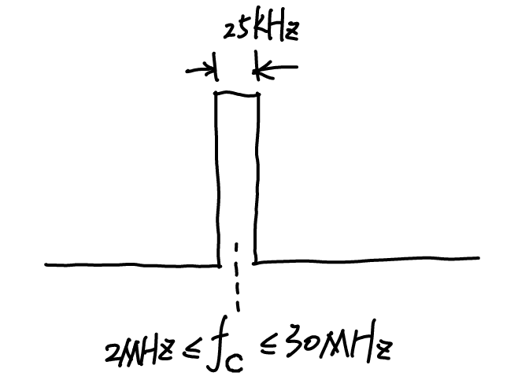

# 信号链的IM

这名是我起的，主要包含了Example3、4两道例题涉及到的知识点。想先讲一下收发机的信号链路，不然做这个题基本等于抓瞎。

## Example3与收发机的信号链路分析

A HF transceiver and a VHF transceiver (both $\mathrm{50\Omega}$) are to operate close to each other. The specifications of the two transceivers are shown in the table. With a separation distance of $100m$, and assuming that the antennas are placed at the same height with maximum coupling, identify the various interference cases and compute the interference margins when the HF is operating at $\mathrm{10MHz}$ and the VHF is operating at $\mathrm{35MHz}$.

首先来看一个最简化的发射与接收的信号链路。根据Friss Transfer Function的顺序进行分析

 

信号链路图

 

### 发射端发射功率 $P_t$

发射端经过本振上变频至射频后滤除多余的频率分量（这边考虑的模型都是零中频的），随后送进功放提高功率送天线进行发射。这就是发射端信号走过的路径。以Example3中HF天线的特性我们来分析一下发射机的特性（暂时不考虑收和发一体的模型，太烦了）。

首先是2-30MHz，这意味着射频部分的工作带宽。本振能够在2-30MHz调整，滤波器、功放、天线都能够支持2-30MHz的发射。与这个频率范围相对的自然是下面的Bandwidth=25kHz，这一带宽是发射机的实时带宽。也就是说，虽然载波频率能够在2-30MHz范围内调整，但同一时刻的频谱宽度只有25kHz.

 

发射机频谱

 

##### 概念：一大堆$dB$

要记住的是只有 $dBm$ 代表的是绝对功率，其他都是相对的功率，也就说 $dB$ 们的计算必须从 $dBm$ 出发到 $dBm$ 去（这话怎么怪怪的）。 $dBc$ 代表相对于中心频率的差值， $dBi$ 代表天线能够提高的增益，路径损耗直接用了 $dB$ 没有后缀。反正只要记住不带 $m$ 的都是相对值，必须有一个绝对值作为参照才能作为最终的结果。

##### 尝试理解老印的脑回路：Spurious Level

按照老印的思路，发射与接收的Spurious Level其实是要分开看的。这一块我觉得他是把发射时的噪声底和接收时下变频后的低通滤波器特性（想要知道这个低通滤波器怎么来的得从盘古开天辟地开始说起了）混在一起讲了，在做题的时候需要发射与接收分开考虑。

 

发射与接收的Spurious不同之处（我的理解）

 

那么在发射端我们就能根据载波发射功率5W进行建模。算一下能知道5W代表 $37dBm$ 。那么就能够根据谐波和杂散两个值画出发射端不含天线增益的频谱。老印对于谐波的建模是所有谐波分量功率均相等，实际上这是不对的。总之按照他的来就对了。

 

发射机没有算上天线增益的完整频谱

 

对于 $-52dBc$ 和 $-32dBc$ ，我的看法是不要过度纠结于他们的符号，有时候你会看到他们前面并没有负号，但这并不影响我们画出频谱图，因为谐波和噪声底的值肯定是小于载波分量的，我们只需要知道这个大小然后做加减法就可以了。

### 发射端天线增益 $G_t$ 

对于天线增益，老印的建模思路是天线带内的增益不变，带外的增益需要根据频率进行计（估）算。这里我又很想骂人了，到底怎么估的？我打算直接计算。dipole那一章的PPT是有点问题的。

老印自己用的dipole公式应该是这个：

$$F\left(\theta,\phi\right)=\frac{cos\left(\beta_0 L cos\theta\right)-cos\left(\beta_0 L\right)}{sin\theta\left(1-cos\left(\beta_0 L\right)\right)}$$

而不是：

$$F\left(\theta,\phi\right)=\frac{sin\left(\beta_0 L cos\theta\right)}{\beta_0 L cos\theta}sin\theta$$

## Example4

