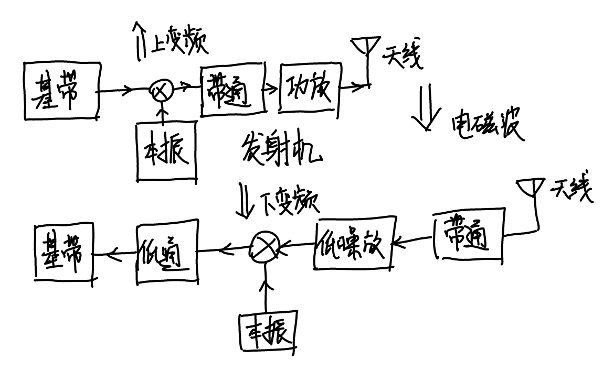

# 信号链的IM

这名是我起的，主要包含了Example3、4两道例题涉及到的知识点。想先讲一下收发机的信号链路，不然做这个题基本等于抓瞎。

## 收发机的信号链路分析

首先来看一个最简化的发射与接收的信号链路。根据Friss Transfer Function的顺序进行分析

 

信号链路图

 

### 发射端发射功率 $P_t$

发射端经过本振上变频至射频后经过选频滤波器（滤除天线工作范围以外的频率分量，本振出来会有谐波分量），随后送进功放提高功率送天线进行发射。这就是发射端信号走过的路径。以Example3中HF天线的特性我们来分析一下发射机的特性（暂时不考虑收和发一体的模型，那玩意还有双工器，太烦了）。

首先是2-30MHz，这意味着射频部分的工作带宽。本振能够在2-30MHz调整，滤波器、功放、天线的通带是2-30MHz，其他频率需要抑制掉。与这个频率范围对应的是下面的Bandwidth=25kHz，这一带宽是发射机的实时带宽，与基带带宽有关。也就是说，虽然载波频率能够在2-30MHz范围内调整，但同一时刻的频谱宽度只有25kHz.

 

发射机频谱

 

##### 概念：一大堆 $dB$

要记住的是只有 $dBm$ 代表的是绝对功率，其他都是相对的功率，也就说 $dB$ 们的计算必须从 $dBm$ 出发到 $dBm$ 去（这话怎么怪怪的）。 $dBc$ 代表相对于中心频率的差值， $dBi$ 代表天线能够提高的增益，路径损耗、极化损失直接用了 $dB$ 没有后缀。反正只要记住不带 $m$ 的都是相对值，必须有一个绝对值作为参照才能作为最终的结果。

##### 尝试理解老印的脑回路：Spurious Level

按照老印的思路，发射与接收的Spurious Level其实是要分开看的（反正不是对收发机完整的建模就是了）。这一块我觉得他是把发射时的噪声底和接收时下变频后的低通滤波器带外抑制（下变频时会产生低频和高频分量，需要滤除高频分量保留低频）混在一起讲了，在做题的时候需要发射与接收分开考虑。因为他在计算的时候发射时的Spurious Level并不会衰减谐波分量，然而在接收时会衰减。

 

发射与接收的Spurious不同之处（我的理解）

 

那么在发射端我们就能根据载波发射功率5W进行建模。算一下能知道5W代表 $37dBm$ 。那么就能够根据谐波和杂散两个值画出发射端不含天线增益的频谱。老印对于谐波的建模是所有谐波分量功率均相等，实际上这是不对的。总之按照他的来就对了。

 

发射机没有算上天线增益的完整频谱

 

对于 $-52dBc$ 和 $-32dBc$ ，我的看法是不要过度纠结于他们的符号，有时候你会看到他们前面并没有负号，但这并不影响我们画出频谱图，因为谐波和噪声底的值肯定是小于载波分量的，我们只需要知道这个大小然后做加减法就可以了。

### 发射端天线增益 $G_t$ 与接收端天线增益 $G_r$

对于天线增益，老印的建模思路是天线带内的增益不变，带外的增益需要根据频率进行计（估）算。

（仔细听了听老印的课，他说这个增益可以直接取带内的增益，问题不大）

#### 偶极子天线

dipole天线可以用公式计算，但是老印给的公式有点问题，他自己用的dipole公式应该是这个：

$$F\left(\theta,\phi\right)=\frac{cos\left(\beta_0 L cos\theta\right)-cos\left(\beta_0 L\right)}{sin\theta\left(1-cos\left(\beta_0 L\right)\right)}$$

而不是前面PPT上出现的：

$$F\left(\theta,\phi\right)=\frac{sin\left(\beta_0 L cos\theta\right)}{\beta_0 L cos\theta}sin\theta$$

#### 孔径天线

对于Example4里的孔径天线，已知 $f_0$ 频率下 $G_{0}$ 的可以推出另一频率 $f_1$ 下的 $G_{1}$

推导过程如下。

$$G_{1}=10log_{10}\left(\frac{4\pi A_e e}{\lambda_1^2}\right)$$

把 $\lambda$ 用 $\frac{c}{f}$ 替换，得到

$$G_{1}=10log_{10}\left(\frac{4\pi A_e e f_0^2}{c^2}\times \frac{f_1^2}{f_0^2}\right)$$

从而得到了

$$G_{1}\left(\mathrm{dB}\right)=G_{0}\left(\mathrm{dB}\right)+20log_{10}\left(f_1\right)-20log_{10}\left(f_0\right)$$

### 路径损耗

没啥好说的，可能是最简单的一个

$$PL(dB)=10log_{10}\left(\frac{\lambda^2}{\left(4\pi r\right)^2}\right)=20log_{10}\left(\frac{300}{4\pi r f_{MHz}}\right)=20log_{10}\left(\frac{300}{4\pi}\right)-20log_{10}{f_{MHz}}-20log_{10}r$$

### 接收端极化损失

判断天线极化类型，极化类型相同就用 $PML\left(\mathrm{dB}\right)=20log_{10}\left(cos\theta\right)$ 

极化类型不同额外加上 $3dB$ 极化损失 $PML\left(\mathrm{dB}\right)=-3+20log_{10}\left(cos\theta\right)$ 

### 接收端灵敏度

这个时候就涉及到了接收机灵敏度。主要关心两个参数，带内的灵敏度和带外抑制，也就是Rx sensitivity和Spurious Level.

带内的灵敏度很好理解，就是接收机工作频率内的灵敏度。带外抑制，按照前文提到的接收机Spurious Level代表下变频低通滤波器的特性，可以对接收机的灵敏度建模。如果一个频率的信号功率大于接收机灵敏度就会被接收机识别到。对于非预期的带外信号，需要功率大于 $-33dBm$ 带内信号则需要大于 $-113dBm$

 

接收机灵敏度建模

 

### IM(Interference Margin)

把发射机产生的所有东西到接收机的功率全部都算出来，对着频率和灵敏度看。只要产生的功率比灵敏度高就意味着会产生干扰，这个差值就是Interference Margin。

#### 概念：TIM

发射端载波频点在接收端产生的干扰量

#### 概念：RIM

发射端在接收端载波频点的干扰量

#### 概念：SIM

除了上述两个频点外其他频率分量在接收端的干扰量。（发射的谐波算在SIM里）

## Example3

A HF transceiver and a VHF transceiver (both $\mathrm{50\Omega}$) are to operate close to each other. The specifications of the two transceivers are shown in the table. With a separation distance of $100m$, and assuming that the antennas are placed at the same height with maximum coupling, identify the various interference cases and compute the interference margins when the HF is operating at $\mathrm{10MHz}$ and the VHF is operating at $\mathrm{35MHz}$.

### HF天线的载波发射功率

没啥好说的。

$${P_{t_{fund}}}\left(\mathrm{dBm}\right)=10log_{10}\left(5000\right)=37\mathrm{dBm}$$

### 谐波分量发射功率

$${P_{t_{harmonic}}}\left(\mathrm{dBm}\right)={P_t}_{fund}-{Harmonic\ Level}=37-32=5\mathrm{dBm}$$

### 发射端噪声底

用Spurious Level算发射端噪声底。

$${P_{t_{noise\ floor}}}\left(\mathrm{dBm}\right)={P_t}_{fund}-{Sprious\ Level}=37-52=-15\mathrm{dBm}$$

### 发射端天线对于各频率分量的增益

这边 $40MHz$ 明明在带外了但是老印没有重新估算增益，姑且按照他的来

$$G_t\left(\mathrm{dBi}\right)=1.8\mathrm{dBi}$$

### 路径损耗

两天线距离 $100m$

$$PL\left(\mathrm{dB}\right)=10log_{10}\left(\frac{\lambda^2}{\left(4\pi r\right)^2}\right)$$

带入不同的频率算得：

$$PL_{10MHz}\left(\mathrm{dB}\right)=-32.44\left(\mathrm{dB}\right)$$

$$PL_{20MHz}\left(\mathrm{dB}\right)=-38.46\left(\mathrm{dB}\right)$$

$$PL_{30MHz}\left(\mathrm{dB}\right)=-41.98\left(\mathrm{dB}\right)$$

$$PL_{35MHz}\left(\mathrm{dB}\right)=-43.32\left(\mathrm{dB}\right)$$

$$PL_{40MHz}\left(\mathrm{dB}\right)=-44.48\left(\mathrm{dB}\right)$$

（谐波到底要算几个老印没有说，算了一下应该是要算到刚好没有产生谐波干扰的那一级谐波）

### 接收端极化损失

两个天线都是线极化，正对，不存在旋转，所以

$$PML\left(\mathrm{dB}\right)=0\left(\mathrm{dB}\right)$$

### 接收端天线增益

某种很不严谨的估算方法，老印说你可以估也可以不估。这边他估了一下， ${G_{r_{20MHz}}}=1.85\left(\mathrm{dBi}\right)$ ${G_{r_{10MHz}}}=1.8\left(\mathrm{dBi}\right)$

其他频率就都是带内的增益 ${G_r}=1.9\left(\mathrm{dBi}\right)$

### 综合考虑所有因素后可以在接收端算出各个频率分量的功率

$$P_r\left(\mathrm{dBm}\right)=P_t\left(\mathrm{dBm}\right)+G_t\left(\mathrm{dBi}\right)+PL\left(\mathrm{dB}\right)+PML\left(\mathrm{dB}\right)+G_r\left(\mathrm{dBi}\right)$$

（我不是很想把谐波和杂散抑制都掺和进这个公式，他们应该在计算 $P_t$ 和接收机灵敏度的时候考虑）

$${P_r}_{10MHz}\left(\mathrm{dBm}\right)=8.2\left(\mathrm{dBm}\right)$$

$${P_r}_{20MHz}\left(\mathrm{dBm}\right)=-29.75\left(\mathrm{dBm}\right)$$

$${P_r}_{30MHz}\left(\mathrm{dBm}\right)=-33.2\left(\mathrm{dBm}\right)$$

$${P_r}_{35MHz}\left(\mathrm{dBm}\right)=-54.6\left(\mathrm{dBm}\right)$$

$${P_r}_{40MHz}\left(\mathrm{dBm}\right)=-35.7\left(\mathrm{dBm}\right)$$

### 接收机的灵敏度特性

接收机带内（ $35\mathrm{MHz}$ ）的灵敏度为 $-113\mathrm{dBm}$

带外的灵敏度为 $-113+80=-33\mathrm{dBm}$

### 计算干扰和IM

考虑接收机的灵敏度特性。

接收机存在 $10\mathrm{MHz}$ 、 $20\mathrm{MHz}$ 、 $35\mathrm{MHz}$ 的干扰，IM就是继续算这边的差值。

### 反过来也是一样的步骤（好烦啊！！！）

## Example4

A rotating navigation radar is being placed on a mast at $11m$ above the ship deck. A $Ku$ band VSAT antenna placed on the deck, $5m$ away from the navigation radar mast is pointing towards a satellite in the aft direction making an elevation angle of $85\degree$ with respect to the horizon. The center of the VSAT antenna is elevated at $1m$ above hthe deck. The navigation radar operates at $9.4GHz$ while the VAST transmits at $14.0GHz$ and received at $11.8GHz$. Compute the RFI among the two systems.

把这个该死的图画出来：

解三角形发现两个天线连线角度位于雷达的远旁瓣，VAST的旁瓣处

（我想知道为什么两边的 $El$ 为啥对应的角度范围不一样， $3dB$ 波束宽度是针对原点对称的，然而Far out sidelobe是 两倍的 $El$ 值，这个老印也没讲咋规定的）

### 雷达的载波发射功率

$$P_{t_{fund}}\left(\mathrm{dBm}\right)=70\left(\mathrm{dBm}\right)$$

### 雷达的谐波功率

$$P_{t_{harmonic}}\left(\mathrm{dBm}\right)=70-50=20\left(\mathrm{dBm}\right)$$

（老印他不算谐波功率啊）

### 雷达的噪声底

$$P_{t_{noise\ floor}}\left(\mathrm{dBm}\right)=70-52=18\left(\mathrm{dBm}\right)$$

### 雷达在不同频率和角度下的增益

通过解三角形，雷达对VAST天线发射用的是远旁瓣，所以载波增益为

$$G_{t_{9.4GHz}}\left(\mathrm{dBi}\right)=31-22=9\left(\mathrm{dBi}\right)$$

套公式可以计算得到在谐波频率下的雷达天线增益：

$$G_{t_{18.8GHz}}\left(\mathrm{dBi}\right)=G_{t_{9.4GHz}}\left(\mathrm{dBi}\right)-20log_{10}\left(9.4GHz\right)+20log_{10}\left(18.8GHz\right)=15.02\left(\mathrm{dBi}\right)$$

$$G_{t_{28.2GHz}}\left(\mathrm{dBi}\right)=G_{t_{9.4GHz}}\left(\mathrm{dBi}\right)-20log_{10}\left(9.4GHz\right)+20log_{10}\left(28.2GHz\right)=18.54\left(\mathrm{dBi}\right)$$

$$G_{t_{37.6GHz}}\left(\mathrm{dBi}\right)=G_{t_{9.4GHz}}\left(\mathrm{dBi}\right)-20log_{10}\left(9.4GHz\right)+20log_{10}\left(37.6GHz\right)=21.04\left(\mathrm{dBi}\right)$$

VAST工作频率下的增益：

$$G_{t_{11.8GHz}}\left(\mathrm{dBi}\right)=G_{t_{9.4GHz}}\left(\mathrm{dBi}\right)-20log_{10}\left(9.4GHz\right)+20log_{10}\left(11.8GHz\right)=10.98\left(\mathrm{dBi}\right)$$

### 路径损耗

距离11.2m，计算载波路径损耗

$$PL_{9.4GHz}\left(\mathrm{dB}\right)=20log_{10}\left(\frac{\lambda}{4 \pi r}\right)=-72.89\left(\mathrm{dB}\right)$$

同理可得谐波和VAST工作频点的：

$$PL_{18.8GHz}\left(\mathrm{dB}\right)=-78.91\left(\mathrm{dB}\right)$$

$$PL_{28.2GHz}\left(\mathrm{dB}\right)=-82.43\left(\mathrm{dB}\right)$$

$$PL_{37.6GHz}\left(\mathrm{dB}\right)=-84.93\left(\mathrm{dB}\right)$$

$$PL_{11.8GHz}\left(\mathrm{dB}\right)=-74.86\left(\mathrm{dB}\right)$$

### 接收端极化损失

发射是水平线极化，接收是圆极化，需要加上常数 $3\mathrm{dB}$

（老印的做法，感觉不对，水平极化的投影能全部投到圆极化的平面上啊）

根据解三角形的结果，电磁波束相对VSAT天线的角度为 $31.6\degree$ 可以计算得到：

$$PML\left(\mathrm{dB}\right)=-3+20log_{10}cos\theta=-4.39\left(\mathrm{dB}\right)$$

极化损失是减小功率的，我在这里取负号（老印的Example里用的是正号，前面是负号，让人感到困惑）

（我觉得这里的极化损失只有 $3dB$ 的线极化到圆极化，姑且按照PPT来）

### 接收端的增益

VSAT天线使用旁瓣接收，所以其工作频率下的增益为：

$$G_{r_{11.8GHz}}\left(\mathrm{dBi}\right)=38-6=32\left(\mathrm{dBi}\right)$$

计算其他频点下的增益：

$$G_{r_{9.4GHz}}\left(\mathrm{dBi}\right)=30.02\left(\mathrm{dBi}\right)$$

$$G_{r_{18.8GHz}}\left(\mathrm{dBi}\right)=36.04\left(\mathrm{dBi}\right)$$

$$G_{r_{28.2GHz}}\left(\mathrm{dBi}\right)=39.57\left(\mathrm{dBi}\right)$$

$$G_{r_{37.6GHz}}\left(\mathrm{dBi}\right)=42.07\left(\mathrm{dBi}\right)$$

### 接收端各个频率分量的功率

不想算啊不想算啊

### VAST接收机的灵敏度

带内 $11.8\mathrm{GHz}$ 的灵敏度是 $-50\mathrm{dBm}$

带外的灵敏度是 $-50+80=30\mathrm{dBm}$

### 综合所有参数计算干扰和IM

可以发现 $9.4\mathrm{GHz}$ 和 $11.8\mathrm{GHz}$ 处都产生了干扰，算一下差值就是IM。