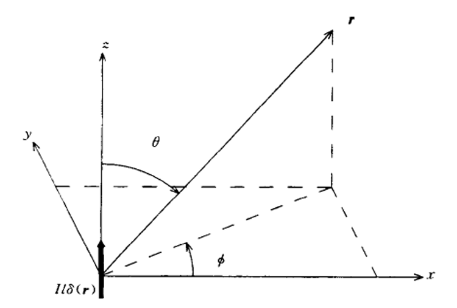

# 天线
## 碎碎念
### 自由空间电磁波阻抗

$$\eta_0=\sqrt{\frac{\mu_0}{\epsilon_0}}=120\pi\Omega$$

### 相位系数

$$\beta_0=\frac{2\pi}{\lambda}$$

### 复习：球坐标系
符号： $\hat r$ 、 $\hat \theta$ 、 $\hat \phi$

 

球坐标表示的赫兹偶极子

 

PPT上球坐标的图实在是太抽象啦

## 赫兹电偶极子
### 整体特性

$$\begin{align} 
    &\widehat {H_r} = 0 \nonumber\\
    &\widehat {H_\theta} = 0 \nonumber\\
    &\widehat {H_\phi} = \frac{\hat I \mathrm{d}l}{4\pi}\beta^2_0 sin\theta \left(j\frac{1}{\beta_0 r}+\frac{1}{\beta_0^2 r^2}\right)e^{-j\beta_0 r} \nonumber\\
    &\widehat {E_r} = 2\frac{\hat I \mathrm{d}l}{4\pi}\eta_0 \beta_0^2 cos\theta\left(\frac{1}{\beta_0^2 r^2}-j\frac{1}{beta_0^3 r^3}\right)e^{-k\beta_0 r} \nonumber\\
    &\widehat {E_\theta} = \frac{\hat I \mathrm{d}l}{4\pi} \eta_0 \beta_0^2 sin\theta \left(j\frac{1}{\beta_0 r}+\frac{1}{\beta_0^2 r^2}-j\frac{1}{\beta_0^3 r^3}\right)e^{-j\beta_0 r} \nonumber\\
    &\widehat {E_\phi} = 0 \nonumber\\
\end{align}$$

### 远场特性

 $r$ 充分大的时候，忽略等式中的 $\frac{1}{r^2}$ 项，式子简化为：

$$\begin{align} 
    &\widehat {H_r} =0 \nonumber \\ 
    &\widehat {H_\theta} = 0 \nonumber\\
    &\widehat {H_\phi} = j\frac{\hat I \mathrm{d}l}{4\pi}\beta_0 sin\theta \frac{1}{r} e^{-j\beta_0 r} \nonumber\\
    &\widehat {E_r} = 0 \nonumber\\
    &\widehat {E_\theta} = j\frac{\hat I \mathrm{d}l}{4\pi}\eta_0\beta_0 sin\theta \frac{1}{r} e^{-j\beta_0 r} \nonumber\\
    &\widehat {E_\phi} = 0 \nonumber\\
\end{align}$$

此时 $\widehat {E_r}=0$ 、 $\widehat {H_r}=0$ ，径向不存在电和磁场。 $\widehat {H_\phi}$ 和 $\widehat {E_\theta}$ 彼此正交，并与电磁波的传播方向正交（球坐标系特性），此时的电磁波以平面波形式传播（TEM波）

### 近场特性
近场中忽略低阶量，高阶量的起主导作用

$$\begin{align} 
    &\widehat {H_r} = 0 \nonumber\\
    &\widehat {H_\theta} = 0 \nonumber\\
    &\widehat {H_\phi} = \frac{\hat I \mathrm{d}l}{4\pi r^2}sin\theta e^{-j\beta_0 r} \nonumber\\
    &\widehat {E_r} = -j2\frac{\hat I \mathrm{d}l}{4\pi}\eta_0\frac{1}{\beta_0 r^3} cos\theta e^{-j\beta_0 r} \nonumber\\
    &\widehat {E_\theta} = -j\frac{\hat I \mathrm{d}l}{4\pi}\eta_0 \frac{1}{\beta_0 r^3} sin\theta e^{-j \beta_0 r} \nonumber\\
    &\widehat {E_\phi} = 0 \nonumber\\
\end{align}$$

$\widehat {E_r}\neq 0$ ，并不是TEM波，是TM波。

特征阻抗：

$$Z_0=\frac{\widehat {E_\theta}}{\widehat{H_\phi}}\sim\frac{\eta_0}{\beta_0 r}\gg \eta_0$$

远近场的交界条件：

$$\beta_0 r=1$$

（复习：相位系数 $\beta_0=\frac{2\pi}{\lambda}$ ）

## 环形电流（由磁偶极子推导而来）
由电与磁的对偶性很容易将电场与磁场互换得到磁偶极子。
### 复习：磁偶极矩

$$\hat m=I \hat S$$

我觉得直接根据面积和右手定则来看磁偶极矩会更直观点，PPT上不直观。

### 整体特性

$$\begin{align} 
    &\widehat {E_r} = 0 \nonumber\\
    &\widehat {E_\theta} = 0 \nonumber\\
    &\widehat {E_\phi} = -j\frac{\hat m \omega \mu_0}{4\pi} \beta_0^2 sin\theta \left(j\frac{1}{\beta_0 r}+\frac{1}{\beta_0^2 r^2}\right)e^{-j\beta_0 r} \nonumber\\
    &\widehat {H_r} = 2j\frac{\hat m \omega \mu_0}{4\pi \eta_0}\beta_0^2 cos\theta \left(\frac{1}{\beta_0^2 r^2}-j\frac{1}{\beta_0^3 r^3}\right)e^{-j\beta_0 r} \nonumber\\
    &\widehat {H_\theta} = j\frac{\hat m \omega \mu_0}{4\pi \eta_0}\beta_0^2 sin\theta \left(j\frac{1}{\beta_0 r}+\frac{1}{\beta_0^2 r^2}-j\frac{1}{\beta_0^3 r^3}\right)e^{-j \beta_0 r} \nonumber\\
    &\widehat {H_\phi} = 0 \nonumber\\
\end{align}$$

### 远场特性
类似的推导，舍弃高阶项。

$$\begin{align} 
    &\widehat {E_r} = 0 \nonumber\\
    &\widehat {E_\theta} = 0 \nonumber\\
    &\widehat {E_\phi} = \frac{\hat m \omega \mu_0}{4\pi r} \beta_0 sin\theta e^{-j\beta_0 r} \nonumber\\
    &\widehat {H_r} = 0 \nonumber\\
    &\widehat {H_\theta} = -\frac{\hat m \omega \mu_0}{4\pi \eta_0 r}\beta_0 sin\theta e^{-j \beta_0 r} \nonumber\\
    &\widehat {H_\phi} = 0 \nonumber\\
\end{align}$$

同样是TEM波

### 近场特性
要推吗，真的要推吗？

能发现是TE波，传播方向存在磁场。

## 两种偶极子的总结

远场条件下电磁波的特性阻抗都是 $120\pi$ （废话，自由空间阻抗），近场条件下电偶极子天线阻抗很高，磁偶极子天线阻抗很低。

## 远场条件（重要）
### 小天线
如果天线的尺寸远小于波长（ $D \ll \lambda$ ），直接近似偶极子，远场条件：

$$R_{ff} > \frac{\lambda}{2\pi}$$

（这里到底有没有等号呀）

### 大天线
另一种情况 $D \gg \lambda$ ，比如孔径天线，接收到的电磁波需要近似为平面波，所以需要路程差 $\Delta \leq \frac{\lambda}{16}$ ，用勾股定理可以得到

$$R+\Delta=\sqrt{R^2+\left(\frac{D}{2}\right)^2}$$

之后泰勒展开取低阶量

$$R+\Delta \approx R+\frac{D^2}{8R}$$

根据前文得到的结论 $\Delta \leq \frac{\lambda}{16}$ ，可以得到

$$\frac{D^2}{8R} \leq \frac{\lambda}{16}$$

从而可以得到远场条件为

$$R_{ff} \geq \frac{2D^2}{\lambda}$$

在EMC测量领域，会令 $\Delta \leq \frac{\lambda}{8}$ 或者 $\Delta \leq \frac{\lambda}{4}$ ，远场条件也随之改变

## 天线的辐射特性

辐射特性一般说的都是远场。

### 线天线

线天线可以视为无数个赫兹电偶极子在直线上排列而成，所以为了获得远场处的电场，需要对整段天线从 $-L$ 到 $L$ 积分。

更具体的推导好像不太重要的样子

#### 概念：归一化电场

$$F\left(\theta,\phi\right)=\frac{E\left(\theta,\phi\right)}{E_{max}}$$

线天线的归一化电场方向函数（此处存疑）：

$$F\left(\theta,\phi\right)=\frac{sin\left(\beta_0 L cos\theta\right)}{\beta_0 L cos\theta}sin\theta$$

老印在计算天线具体参数时用的dipole公式应该是这个：

$$F\left(\theta,\phi\right)=\frac{cos\left(\beta_0 L cos\theta\right)-cos\left(\beta_0 L\right)}{sin\theta\left(1-cos\left(\beta_0 L\right)\right)}$$

这两个公式有着细微的误差，是在积分时展开项不同导致的。

### 方向图的参数们

主瓣、增益、3dB波束宽度、第1零点、第1旁瓣、后瓣

## 天线的方向性
### 概念：立体角

符号是 $\Omega$ 与单位球面上的一块面积有关，整个单位球的立体角为 $4\pi \mathrm{sr}$

小知识：

$$\mathrm{d}\Omega=sin\theta \mathrm{d}\theta \mathrm{d}\phi$$

### 概念：平均功率 $P_{ave}$

$$P_{ave}=\frac{1}{4\pi}\iint\limits_{4\pi}P\left(\theta,\phi\right)\mathrm{d}\Omega$$

对所有方向的功率进行积分并除以球面的立体角 $4\pi$，得到等效的在球面上的平均功率。

### 概念：归一化功率 $P_n\left(\theta, \phi\right)$

$$P_n\left(\theta, \phi\right)=\frac{P\left(\theta,\phi\right)}{P_{max}}$$

归一化电场与归一化功率的关系

$$P_n\left(\theta, \phi\right)=\left|F\left(\theta, \phi\right)\right|^2$$

### 概念：方向性 $D$

$$D=\frac{P_{max}}{P_{ave}}=\frac{4\pi}{\iint\limits_{4\pi}P_n\left(\theta, \phi\right)\mathrm{d}\Omega}$$

### 概念：波束范围 $\Omega_A$

$$\Omega_A=\iint\limits_{4\pi}P_n\left(\theta,\phi\right)\mathrm{d}\Omega$$

从而可以得到方向性 $D=\frac{4\pi}{\Omega_A}$ （哪来这么多概念啊，草）

### 各向同性天线
辐射特性是个球， $P_n\left(\theta,\phi\right)=1$ ， $D=1$ 

### 赫兹电偶极子的方向性
先计算归一化电场，远场条件下的电场为：

$$\widehat {E_\theta} = j\frac{\hat I \mathrm{d}l}{4\pi}\eta_0\beta_0 sin\theta \frac{1}{r} e^{-j\beta_0 r}$$

先归一化电流

$$\widehat {E_\theta} = j\frac{\mathrm{d}l}{4\pi}\eta_0\beta_0 sin\theta \frac{1}{r} e^{-j\beta_0 r}$$

除一下

$$F\left(\theta,\phi\right)=\frac{j\frac{\mathrm{d}l}{4\pi}\eta_0\beta_0 sin\theta \frac{1}{r} e^{-j\beta_0 r}}{j\frac{\mathrm{d}l}{4\pi}\eta_0\beta_0 sin\theta_{max} \frac{1}{r} e^{-j\beta_0 r}}$$

直接全部拿掉

$$F\left(\theta,\phi\right)=\frac{sin\theta}{sin\theta_{max}}$$

在球坐标系中 $\theta$的取值范围是 $0 \sim \pi$ 所以可以发现

$$sin\theta_{max}=sin\theta {|}_{\theta=\frac{\pi}{2}}=1$$

所以得到

$$F\left(\theta,\phi\right)=sin\theta$$

获得归一化电场后就是计算波束范围

$$\Omega_A=\iint\limits_{4\pi}\left|F\left(\theta,\phi\right)\right|^2\mathrm{d}\Omega$$

带入上面计算得到的归一化电场，打开二重积分（ $\mathrm{d}\Omega=sin\theta\mathrm{d}\theta\mathrm{d}\phi$ ）不想积了，直接抄

$$\begin{equation}
    \begin{split}
        \Omega_A &=\int\limits_{0}^{2\pi} \int\limits_{0}^{\pi}sin^2\theta sin\theta\mathrm{d}\theta\mathrm{d}\phi \\
        &= \frac{8\pi}{3}
    \end{split} \nonumber
\end{equation} \nonumber$$

根据波束范围的概念，可以算出方向性 $D=\frac{4\pi}{\Omega_A}=1.5$

### $\lambda/2$偶极子天线

$$F\left(\theta,\phi\right)=\frac{cos\left(\frac{\pi}{2}cos\theta\right)}{sin\theta}$$

$$\Omega_A=7.66$$

$$D=1.64$$

### $1\lambda$偶极子天线

$$F\left(\theta,\phi\right)=\frac{cos\left(\pi cos\theta\right)+1}{2sin \theta}$$

$$\Omega_A=5.21$$

$$D=2.41$$

### 很长的线天线

$$D \sim \frac{2L}{\lambda} \left(L \gg \lambda\right)$$

L是天线长度

### 孔径天线

$$D=\frac{4\pi A_e}{\lambda^2}$$

孔径天线的有效截面积：

$$A_e=A\times e_{ap}$$

孔径效率： $e_{ap}$

孔径面积： $A$

## 天线增益
综合考虑方向性和天线的损耗后可以得到，单位是 $\mathrm{dBi}$  ，在没有特殊说明的情况下天线增益均是指最大辐射方向的增益：

$$G=10log_{10}\left(D\times e\right)$$

 $e$ 是天线的效率。老师PPT上放的公式是孔径天线的，我觉得这里应该用普适的公式，所以删了。

天线在某一方向增益的定义，在**该方向的功率密度**除以参考天线在**相同输入功率时**最大辐射功率密度（对于dBi参考的全向天线，最大辐射功率密度和辐射的平均功率密度相同，所以直接 $P_{in}$ 除 $4\pi$），所以有：

$$G=10log_{10}\left(\frac{P_{\theta}}{\frac{1}{4\pi}P_{in}}\right)\left(\mathrm{dBi}\right)$$

从这里得到用最大功率密度定义的式子是这么推的：

$$G=10log_{10}\left(\frac{P_{max}}{\frac{1}{4\pi}P_{in}}\right)=10log_{10}\left(\frac{P_{max}}{P_{ave}}\frac{P_{ave}}{\frac{1}{4\pi}P_{in}}\right)=10log_{10}\left(\frac{P_{max}}{P_{ave}}\frac{P_t}{P_{in}}\right)=10log_{10}\left(De\right)$$

如果 $e=1$ 有 $\frac{P_{in}}{4\pi}=\frac{P_{t}}{4\pi}=P_{ave}$：

$$G=10log_{10}\left(\frac{P_\theta}{P_{ave}}\right)$$

也可以推出在例题中出现的二级结论：

$$G=10log_{10}\left(D\times P_{n_{{\theta=30\degree}}}\right)$$

### 无耗偶极子天线
赫兹偶极子 $D=1.5$ ， $G=10log_{10}\left(1.5\right)=1.76dBi$

$\lambda/2$ 偶极子天线 $D=1.64$ ， $G=10log_{10}\left(1.64\right)=2.14dBi$

$1\lambda$ 偶极子天线 $D=2.41$ ， $G=10log_{10}\left(2.41\right)=3.82dBi$

### 无耗孔径天线
TODO

### 有损耗孔径天线
TODO

## 半功率波束宽度/3dB波束宽度
长度为 $L$ 的线天线，电流分布为

$$I\left(r\right)=cos^n\left(\frac{\pi r}{L}\right)$$

直径为 $a$ 的圆形喇叭天线

这里的n我没找到具体的含义，应该是天线长度和波长的关系？

高指向天线的估算方法（奇怪的经验公式增加了）：

$$D \approx \frac{4\pi}{\theta_{1r}\theta_{2r}}$$

角度制我就不写了，360转一下的事

# 例题题解
## Example 1a

天线类型：圆形喇叭天线，属于孔径天线，直径10cm，题目假设没有损耗，孔径效率60%

频点： $12GHz$ ，波长 $0.025m$ ； $15GHz$ ，波长 $0.020m$ ； $18GHz$ ，波长 $0.01667m$

计算：套孔径天线的公式

$$A_e=A\times e_{ap}=\pi\times 0.05^2\times0.6$$

$$D=\frac{4\pi A_e}{\lambda^2}=94.75$$

$$G=10log_{10}\left(De\right)=10log_{10}\left(94.75\times1\right)=19.76dBi$$

$$D \approx \frac{4\pi}{\theta_{1r}\theta_{2r}}$$ 

这里PPT直接写等于号了，让我大为恼火。由于是圆形喇叭天线，所以可以得到 $\theta_{1r}=\theta_{2r}$ ，代入解得 $\theta_{1r}=\theta_{2r}=0.364$

其他频点不算了

## Example 1b
#### （a）

线天线的归一化电场：

$$F\left(\theta,\phi\right)=\frac{sin\left(\beta_0 L cos\theta\right)}{\beta_0 L cos\theta}sin\theta$$

$L$ 是天线长度的一半

赫兹偶极子的归一化电场（ $L$ 很小，使用著名等价无穷小，用前面PPT推的内容也能直接做出来）：

$$\lim_{L \to 0} F\left(\theta,\phi\right)=sin\theta$$

随后得到归一化功率

$$P_n\left(\theta,\phi\right)=sin^2\theta$$

天线在某一方向增益的定义，在该方向的功率密度除以参考天线在相同输入功率时最大辐射功率密度（对于dBi参考的全向天线，最大辐射功率密度和辐射的平均功率密度相同），所以有：

$$G=10log_{10}\left(\frac{P_{\theta}}{\frac{P_{in}}{4\pi}}\right)\left(\mathrm{dBi}\right)$$

这里由于 $e=1$ 所以有 $\frac{P_{in}}{4\pi}=\frac{P_{t}}{4\pi}=P_{ave}$：

$$G=10log_{10}\left(\frac{P_{\theta=30\degree}}{\frac{P_{in}}{4\pi}}\right)=10log_{10}\left(\frac{P_{\theta=30\degree}}{P_{ave}}\right)=10log_{10}\left(\frac{P_{max}}{P_{ave}}\times\frac{P_{\theta=30\degree}}{P_{max}}\right)=10log_{10}\left(D\times P_{n_{{\theta=30\degree}}}\right)=-4.25dBi$$

这里可以看到一个二级结论 $G=10log_{10}\left(D \times P_n\right)$

#### （b）

复习：

$$\beta_0=\frac{2\pi}{\lambda}$$

长度是 $1\lambda$ 的话， $L=\frac{\lambda}{2}$ ，可以得到

$$F\left(\theta,\phi\right)=\frac{sin\left(\pi cos\theta\right)sin\theta}{\pi cos\theta}$$

使用背书技能得到 $D=2.41$ ，用上文得到的二级结论可以算出来

$$G=10log_{10}\left(2.41\times F^2|_{\theta=45\degree}\right)=-8.1dBi$$