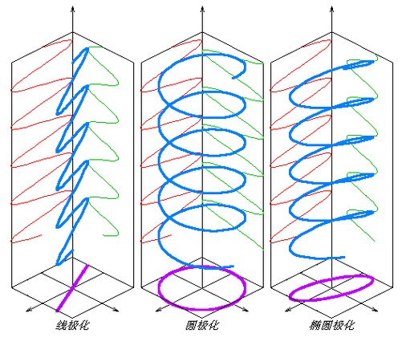
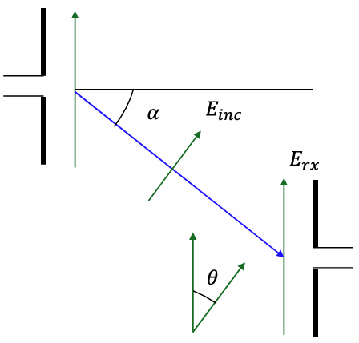

# 波的传导
## 概念：有效辐射功率ERP

$$ERP=P_t\times G_t$$

其中 $P_t=P_{in} \times e_t$

 $P_t$ 是发射功率， $G_t$ 是发射端增益。

## 概念：远场功率密度

$$P_d=\frac{ERP}{4\pi r^2}$$

这个比较好理解，有效辐射功率除球面，推出来平方律

### 远场的电场

$$E= \sqrt{{P_d} \times \eta_0} =\frac{1}{r}\sqrt{ 30 \times ERP}$$

推导：考虑坡印廷矢量

$$\mathbf{S}=\mathbf{E}\times\mathbf{H}$$

使用波动方程的一般解

$$
\begin{cases}
    \mathbf{E}=\hat {x} E_0 cos \left(kz-\omega t\right) \\
    \mathbf{H}=\hat {y} E_0 cos \left(kz-\omega t\right) \\
    \eta_0=\frac{E_0}{H_0}
\end{cases}
$$

代入坡印廷矢量，可以得到

$$\mathbf{S}=\hat {z} \sqrt{\frac{\epsilon_0}{\mu_0}}E_0^2 cos^2\left(kz-\omega t\right)$$

此时求得的能流密度为瞬时值，在时间上积分求平均值，这个平均值的模长就是老印的 $P_d$

$$\left \langle S \right \rangle=\frac{1}{T}\int_{0}^{T}\mathbf{S}\mathrm{d}t=\hat z \frac{1}{2}\frac{E_0^2}{\eta_0}=\hat z P_d$$

如果将峰值 $E_0$ 用RMS值 $E_{rms}$ 代入，可得

$$P_d=\frac{E_{rms}^2}{\eta_0}$$

（Alphone老哥怎么又换了一种电磁波特征阻抗的表示方法）

对于自由空间电磁波阻抗我们现在有 $Z_{\omega}$ 、 $\eta_0$ 、 $Z_w$ 好几种表示方法，我这里就统一用 $\eta_0$ 了

## 概念：接收功率与Friss传输方程

$$P_r=P_d\times A_e\times e_r=P_t G_t G_r \frac{\lambda^2}{\left(4\pi r\right)^2}$$

我认为这里需要乘上接收端天线的效率，毕竟你 $G_r$ 不可能直接从 $D$ 得到的，必定是 $G_r=D_r\times e_r$ ，代入有效孔径后就是上面的式子。Example2a里的的 $G$ 就是有天线效率的。

此时得到的

$$P_t G_t G_r \frac{\lambda^2}{\left(4\pi r\right)^2}$$

被称为Friss传输方程

## 路径损耗

Friss传输方程的最后一项被称为路径损耗

$$PL=\frac{\lambda^2}{\left(4\pi r\right)^2}$$

如果用dB表示的话

$$PL(dB)=10log_{10}\left(\frac{\lambda^2}{\left(4\pi r\right)^2}\right)=20log_{10}\left(\frac{300}{4\pi r f_{MHz}}\right)=20log_{10}\left(\frac{300}{4\pi}\right)-20log_{10}{f_{MHz}}-20log_{10}r$$

对于dB形式的Friss传输方程只需要算加减法就好了。

## 极化损失PML

我把老印放在噪声容限里的极化损失放到波的传导这里了，这样比较符合复习时的逻辑。

对于一束电磁波，极化特性指的是电场分量随时间变化的情况。这门课里遇到的主要是线极化和圆极化。

 

各种极化方式

 

### 线极化的远场端极化损失计算

产生这种极化类型的天线一般都是偶极子天线、八木天线。根据线极化角度相对于地面的情况，分为垂直极化和水平极化。

计算极化损失时，考虑的是位于远场的接收端天线相对于需要接收的电磁波的极化损失。在远场时电磁波传播模式是TEM波，电场方向正交于电磁波传播方向。

如果两个天线的极化方向相同，但是位置错开，我们只需要知道接收端天线相对于电磁波传播方向的夹角就可以计算极化损失。这部分的原理非常简单，只需要知道电磁波的电场在天线位置上的投影就行。（由于旋转导致的极化损失好像不要求，不写了）

 

计算电场的投影

 

所以可以得到：

$$E_{rx}=E_{inc}cos\theta$$

需要注意的是极化损失计算的是功率上的损失，接收端接收功率与电磁波在这个位置的功率关系为：

$$P_{rx}=\frac{E_{rx}^2}{\eta_0}=P_{inc}cos^2\theta$$

其中 $\eta_0$ 是电磁波的特征阻抗， $\theta$ 代表的角度永远是接收端天线相对于电磁波的角度，由于已经处于远场所以和发射端关系不大。

以对数形式表示的话就是：

$$P_{rx}\left(\mathrm{dB}\right)=P_{inc}\left(\mathrm{dB}\right)+20log_{10}\left(cos\theta\right)$$

### 线极化的远场端极化损失计算

圆极化可以分为顺时针圆极化和逆时针圆极化，可以视为两个线极化的叠加。所以传递到线极化的话自然存在损失，这个值老印取了大约 $3dB$

在计算圆极化与线极化之间造成的极化损失时只需要在 $20log_{10}\left(cos\theta\right)$ 的基础上额外损失 $3dB$ 就可以了。

# 例题题解
## Example2a

回忆孔径天线的远场公式

$$R_{ff} \geq \frac{2D^2}{\lambda}$$

D在这里是天线的最大尺寸，不是方向性

根据天线的增益计算尺寸：

$$G=\frac{4\pi A_e e}{\lambda^2}=\frac{4\pi A e_{ap} e}{\lambda^2} \implies A=\frac{G \lambda^2}{4\pi e_{ap} e}$$

把数据全部都代进去解得

$$A=\frac{10^{3.5}\times 0.1^2}{4 \pi\times 0.6 \times 1}=\frac{25\sqrt{10}}{6\pi}\approx 4.19m^2$$

算圆形孔径天线的直径

$$\pi \left(\frac{D}{2}\right)^2=A \implies D=2.31m$$

计算远场条件

$$R_{ff} \geq \frac{2D^2}{\lambda}$$ 

（？？？又和前面的PPT不一样了，摆了，懂意思就成）

## Example2b

使用远场功率密度公式：

$500m$
$$P_d=\frac{P_t G_t}{4\pi r^2}=10.065W/m^2$$

$5000m$
$$P_d=\frac{P_t G_t}{4\pi r^2}=0.1W/m^2$$

这边老印计算电场的公式之前没有出现过，给出推导：

考虑坡印廷矢量：

$$\mathbf{S}=\mathbf{E}\times\mathbf{H}$$

使用波动方程的一般解

$$
\begin{cases}
    \mathbf{E}=\hat {x} E_0 cos \left(kz-\omega t\right) \\
    \mathbf{H}=\hat {y} E_0 cos \left(kz-\omega t\right) \\
    \eta_0=\frac{E_0}{H_0}
\end{cases}
$$

r=500m:
$$E_{rms}=\sqrt{P_d\times \eta_0}=\sqrt{10.065\times 120\pi}=61.59 V/m$$

r=5000m
$$E_{rms}=\sqrt{P_d\times \eta_0}=\sqrt{0.1\times 120\pi}=6.14 V/m$$

## Example2c

考虑Friss传输方程：

$$P_r\left(\mathrm{dBm}\right)=P_t\left(\mathrm{dBm}\right)+G_t\left(\mathrm{dBi}\right)+PL\left(\mathrm{dB}\right)+G_r\left(\mathrm{dBi}\right)+PML\left(\mathrm{dB}\right)$$

这里不说极化损失，不管；接收功率用接收机灵敏度代，发射机天线增益用第一旁瓣的增益代，带入其他数据后解得：

$$-45=70+10+PL_{min}+2+0 \implies PL_{min}=-127$$

$$PL=10\log_{10}\left(\frac{\lambda^2}{\left(4\pi r\right)^2}\right) \implies r=17.815\mathrm{km}$$
